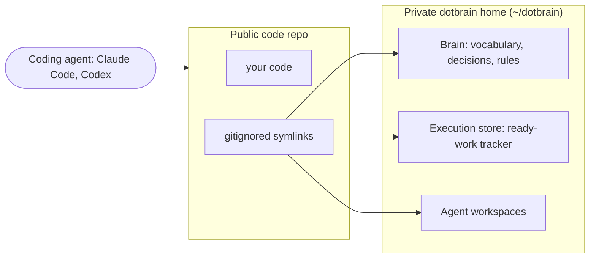

<p align="center">
  
</p>

# Dotbrain

> Dotbrain keeps your project's context private and your code repo clean, and makes that discipline effortless.

As an engineer, almost everything I build eventually crosses a public line. A side project I start
in private gets shared or open-sourced later; the team and open-source repos I work in are public or
shared from the start. The code can live in the open; the thinking behind it cannot: the half-formed
decisions, the roadmap, the rationale I would not want published, or pasted by an agent into a commit
message. For a while that thinking lived in my head, which meant re-explaining my own project to the
agent every session. So I built Dotbrain.

## Why not just keep private notes?

A gitignored notes file is the obvious fix, but I wanted those notes versioned, so they became a
separate private repo. That is what I did for a long time. It kept them private and tracked, but it
sat off to the side of the project: when I spun up a git worktree to run a second agent in parallel,
the notes did not come with it; when I cloned the project onto another machine, they were not there
either. The context I needed most was the context that never followed the work.

Dotbrain keeps the Brain just as private and versioned, but wires it into the project from a single
private home. A worktree picks it up automatically. A new machine is one clone and bootstrap away
from having every project wired. The notes are there wherever you work the project, instead of
sitting beside it.

## "But my agent already remembers, and I have CLAUDE.md/AGENTS.md"

**Agent session memory** carries context between sessions, but you cannot easily see, review, or
correct what it holds, and it stays locked inside that one tool. Memory banks have the same shape:
they accumulate scattered, durable facts about you, not the specifics of one project.

**CLAUDE.md/AGENTS.md** is great for a handful of standing instructions, but it lives in the public
repo and should not become the home for every decision and design note. Past a point it just bloats,
and everything in it is public if the repo is.

## Is this for you?

**Use Dotbrain if:**

- you run more than one coding agent (Claude Code, Codex), or many worktrees, on the same project
- your work crosses a public line: private-first projects you later share, or team and open-source repos
- you want your project's decisions and roadmap private but reviewable, not trapped inside one
  tool's memory

**Skip it if:**

- all your repos are private and one agent's built-in memory already covers you
- you only need a few standing instructions in the repo; `CLAUDE.md` is genuinely simpler
- you are looking for a hosted team knowledge base

## How it works



`dotbrain wire <repo>` creates the private Brainspace and drops gitignored symlinks at your repo
root that point into it: the Brain (vocabulary, decisions, rules), an execution store (a
dependency-aware issue tracker, Beads by default), and the agent workspaces. A session-start hook
loads the project's context into the agent automatically, so it starts warm. The boundary then
holds by construction:

- **Nothing leaks by accident.** The links are gitignored, so private state cannot be committed
  into the code repo.
- **Public docs are derived, never mirrored.** When something needs to be public, you author a
  fresh, audience-specific doc, instead of syncing a copy of the private source that can drift back
  into a leak.

Worktrees reach the same Brain through the same symlinks, never a per-worktree copy.

## Install

```bash
git clone https://github.com/arminzou/dotbrain.git
cd dotbrain
./install.sh        # installs uv, Beads (bd), and the dotbrain CLI
dotbrain bootstrap  # install agent hooks and link global skills
```

## Use

```bash
dotbrain wire <repo>      # connect a code repo to a private Brainspace
dotbrain refresh          # repair wiring, load execution state, link project skills
dotbrain unwire <repo>    # disconnect a repo from its Brainspace
```

## Develop

The CLI is a [uv](https://docs.astral.sh/uv/)-managed Python package.

```bash
uv sync                 # provision the env
uv run dotbrain --help  # inspect the command tree
uv run pytest           # run the test suite
```

## Learn more

- [AGENTS.md](AGENTS.md): the system model and agent entrypoint.
- [docs/architecture.md](docs/architecture.md): the design narrative covering Brainspaces, the
  Brain and execution split, skills, and the public/private boundary.
