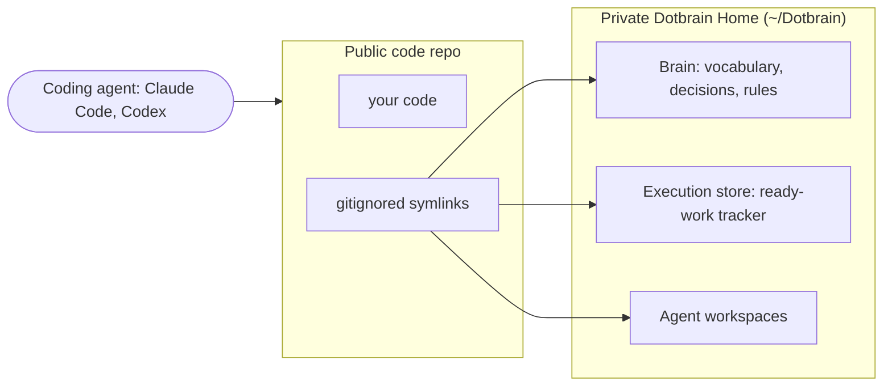

# Dotbrain

> Dotbrain keeps your project's context private and your code repo clean, and makes that discipline effortless.

Coding agents are only as good as the context they start with. Dotbrain stores each project's
durable context (domain vocabulary, architectural decisions, operating rules, and a live issue
tracker) in a private **Brainspace** outside the code repo, then wires it into your agent (Claude
Code, Codex) through gitignored symlinks. The agent sees one tree, starts warm, and your repo
never carries the private material.

## The problem

A coding agent starts every session cold. The context that makes it effective (what the project's
terms mean, why past decisions were made, what work is in flight) usually lives in someone's head
or scattered across docs. You get two bad options for fixing that:

- **Put it in the code repo.** Now private thinking leaks into a public or shared repo, and the
  material rots next to code it is not.
- **Keep re-explaining it.** Every session starts from zero.

Dotbrain takes a third path: give the project a structured context store that lives outside the
repo, and wire it in so each session starts warm with nothing leaking back.

## How it works



`dotbrain wire <repo>` creates the private Brainspace and drops gitignored symlinks at your repo
root that point into it. A session-start hook loads the project's context into the agent
automatically. The boundary then holds by construction:

- **Nothing leaks by accident.** The links are gitignored, so private state cannot be committed
  into the code repo.
- **Public docs are derived, never mirrored.** When something needs to be public, you author a
  fresh, audience-specific doc. You never sync a copy of the private source that can drift back
  into a leak.

## Inside a Brainspace

- **Brain**: the durable knowledge. Domain vocabulary so language does not drift into synonyms,
  architectural decisions with their rationale, and the operating rules an agent should follow.
- **Execution store**: a dependency-aware issue tracker (Beads by default), so "what is ready to
  work on" is a query, not a stale markdown checklist.
- **Agent workspaces**: the per-project settings for the runtimes you wire, shared across git
  worktrees through the same links rather than copied per worktree.

## What Dotbrain is not

Dotbrain does not try to win any one of these races. It wires capable tools together and keeps the
boundary intact.

- **Not a memory store.** It wires whatever context you author; it does not reinvent agent memory.
- **Not a new tracker.** It uses a swappable execution engine; the value is the wiring and the
  discipline, not the tracker.
- **Not another rules file.** Warm context is table stakes it delegates to the agent runtime.

The point is the boundary and the wiring: private brain, clean repo, warm agent, in one command.

## Install

```bash
git clone https://github.com/arminzou/dotbrain.git
cd dotbrain
./install.sh        # installs uv, Beads (bd), and the Dotbrain CLI
dotbrain bootstrap  # install agent hooks and link global skills
```

## Use

```bash
dotbrain wire <repo>      # connect a code repo to a private Brainspace
dotbrain refresh          # repair wiring, load execution state, link project skills
dotbrain unwire <repo>    # disconnect a repo from its Brainspace
```

## Develop

The CLI is a [uv](https://docs.astral.sh/uv/)-managed Python package.

```bash
uv sync                 # provision the env
uv run dotbrain --help  # inspect the command tree
uv run pytest           # run the test suite
```

## Learn more

- [AGENTS.md](AGENTS.md): the system model and agent entrypoint.
- [docs/architecture.md](docs/architecture.md): the design narrative covering Brainspaces, the
  Brain and execution split, skills, and the public/private boundary.
