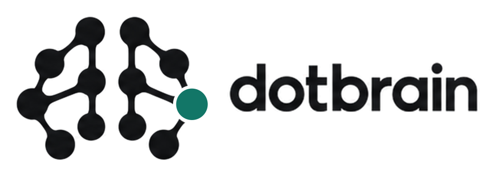
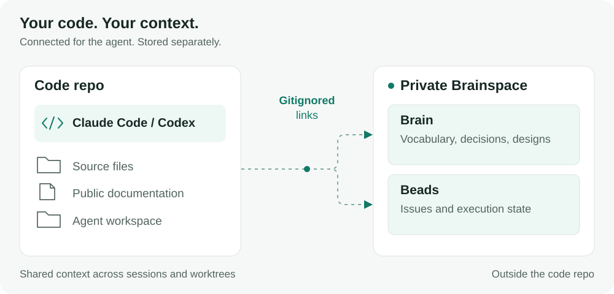

<p align="center">
  <picture>
    <source media="(prefers-color-scheme: dark)" srcset="docs/public/assets/lockup-horizontal-dark-1024.png">
    <source media="(prefers-color-scheme: light)" srcset="docs/public/assets/lockup-horizontal-light-1024.png">
    
  </picture>
</p>

# Dotbrain

[](https://pypi.org/project/dotbrain/)
[](https://github.com/arminzou/dotbrain/actions/workflows/ci.yml)
[](https://pypi.org/project/dotbrain/)
[](LICENSE)
[](https://arminzou.github.io/dotbrain/)

**Private project context for Claude Code and Codex.**

Give each coding agent your project's decisions, vocabulary, and issues. Keep that context
versioned and outside your code repo.

[Documentation](https://arminzou.github.io/dotbrain/) ·
[Getting started](https://arminzou.github.io/dotbrain/getting-started) ·
[The workflow](https://arminzou.github.io/dotbrain/workflow)

### Why I built it

I built Dotbrain because my projects often start privately and get shared later. The code can be
shared; the half-formed decisions, roadmap, and rationale need their own home. Mine scattered
across Obsidian, gitignored notes, and agent memory. Every new session meant hunting for context
and explaining the project again. I wanted that thinking versioned, available to both agents,
and connected to the work.

## Is this for you?

Use Dotbrain if you work across agents, sessions, or worktrees and have project context worth
preserving. It gives that context a home you can review and version with Git, separate from the
code you share.

If a few standing instructions in `AGENTS.md` or `CLAUDE.md` cover your needs, keep it simple.
Dotbrain is a local tool, not a hosted team knowledge base.

## Get started

Install the plugin into your coding agent. You do not need to clone this repo.

**Claude Code** — send these as two separate prompts:

```text
/plugin marketplace add arminzou/dotbrain
/plugin install dotbrain@dotbrain
```

**Codex:**

```bash
codex plugin marketplace add arminzou/dotbrain
codex plugin add dotbrain@dotbrain
```

In Codex, open `/hooks`, trust the dotbrain hook, then start a new thread.
On Windows, enable
[Developer Mode](https://learn.microsoft.com/windows/apps/get-started/enable-your-device-for-development)
before wiring so Dotbrain can create directory symlinks without Administrator privileges.

Then ask your agent:

```text
Use wire-brain to wire this repo with Dotbrain.
```

The skill installs the matching CLI, `uv`, and Beads if needed, prepares the machine, and wires
the repo to its private Brainspace. Check the result with:

```bash
dotbrain doctor
```

Start a fresh agent session in the wired repo to load its Brain context.
See [Getting started](https://arminzou.github.io/dotbrain/getting-started) for manual installation,
backups, a second machine, and troubleshooting.

## How it works

Each project has a **Brainspace** under your private dotbrain home, by default `~/dotbrain/`.
It holds the **Brain** (vocabulary, decisions, and designs) and an **execution store**
(issues tracked with [Beads](https://github.com/gastownhall/beads)). Gitignored symlinks connect
the code repo to that Brainspace; the private files are stored outside the code repo.

<picture>
  <source media="(prefers-color-scheme: dark)" srcset="docs/public/assets/how-it-works-dark.svg">
  <source media="(prefers-color-scheme: light)" srcset="docs/public/assets/how-it-works-light.svg">
  
</picture>

The plugin's session-start hook loads project context. Its skills guide work when invoked,
and wiring links selected skills and subagents into the repo's agent workspaces.
Worktrees can connect to the same Brainspace and share its context and execution state.

Git versions the Brain. Back it up to a **private** remote; the Beads database is Git-ignored
and needs its own Dolt remote or shared server to back up or share issues.
See [Architecture](https://arminzou.github.io/dotbrain/architecture),
[Wiring](https://arminzou.github.io/dotbrain/wiring), and
[Beads backend](https://arminzou.github.io/dotbrain/beads-backend) for details.

## The loop

Every piece of work should leave the next session better informed. Dotbrain's bundled skills
carry work from idea to implementation, then return what you learned to the project's context.

**Start from the Brain → explore unknowns → settle decisions → write a design → work and
verify issues → review → return lasting decisions to the Brain.**

The loop closes in two places:

- **During the work:** discoveries feed back into the active design and affected issues. An
  unexpected API constraint becomes a design question; once you settle it, the design and issues
  capture the decision before implementation continues.
- **After review:** closing the design records the evidence and preserves useful decisions and
  vocabulary in the Brain. The next initiative starts with that knowledge already available.

The Brain holds durable knowledge, the design holds current intent, and Beads holds execution
state. Each handoff lives in a document or tracker entry, so another session or agent can pick
up the work without reconstructing it from chat history.

You own the success criteria and the final review decision. Use the full loop when work spans
sessions or carries open questions; small changes can use just the steps they need.

See [The workflow](https://arminzou.github.io/dotbrain/workflow) for a walkthrough and
[Skills](https://arminzou.github.io/dotbrain/skills) for the full catalog.

## Develop

The CLI is a [uv](https://docs.astral.sh/uv/)-managed Python package.

```bash
git clone https://github.com/arminzou/dotbrain.git
cd dotbrain
uv sync
uv run dotbrain --help
uv run pytest
```

For an editable CLI, run `./scripts/dev-install.sh` (or `.\scripts\dev-install.ps1` on Windows),
then `dotbrain bootstrap`. Bundled skills are authored in [`plugin/skills/`](plugin/skills/).
See the [CLI reference](https://arminzou.github.io/dotbrain/cli-reference) for commands and options.

Released under the [MIT License](LICENSE).
