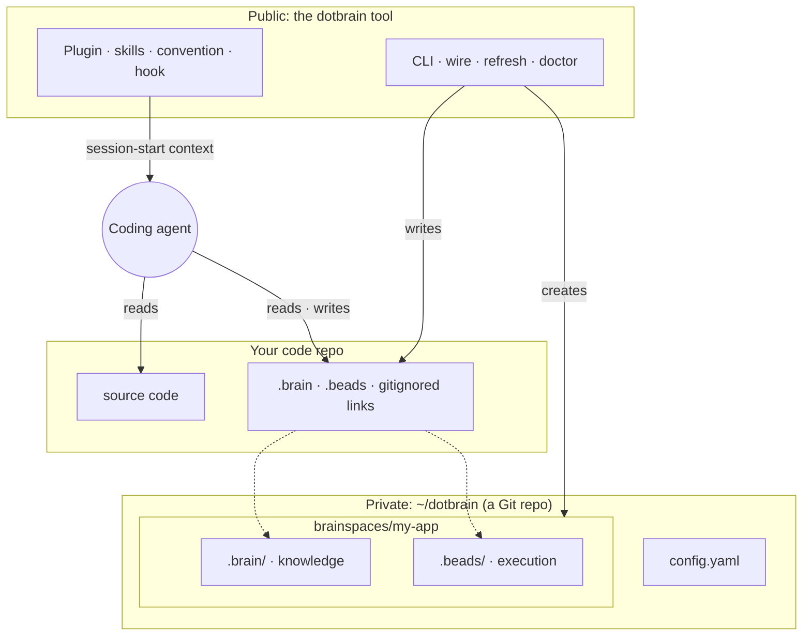
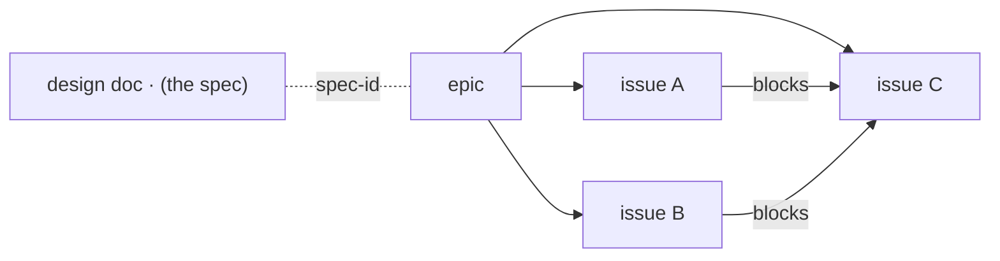

# Architecture

This page explains dotbrain's design: Brainspaces, the split between the Brain and execution,
skills, and the public/private boundary.

## The Big Picture

Three parts, three owners:

- **The tool** is public and the same for everyone.
- **The dotbrain home** is yours and private. It holds every project's Brainspace and is versioned
  as one Git repository.
- **The code repo** stays the code repo. It gains a few ignored links and nothing else.

## Brainspaces

A **Brainspace** is one directory per project that holds everything an agent needs that is not the
code itself:

- `.brain/` is the project's knowledge.
- `.beads/` is the execution store: issues, dependencies, and plans.

The code repo reaches its Brainspace through the gitignored `.brain` and `.beads` symlinks. Its
`.claude` and `.codex` agent workspaces are real directories; dotbrain adds individually ignored
skill and subagent links without claiming project-owned files. The agent sees one tree, the repo
stays clean, and the context stays private. [Wiring](wiring.md) covers the details.

## The Brain

Each element of a Brain has one purpose:

| Element | Holds | Changes when |
| --- | --- | --- |
| `CONTEXT.md` | Domain vocabulary: the names issues, plans, and code use | A concept is named or sharpened |
| `adr/` | Architecture Decision Records, one per decision | A hard-to-reverse choice with a real trade-off is made |
| `designs/` | Design docs, one initiative per file | An initiative is planned, built, or closed |
| `AGENTS.md` | This project's agent conventions | Working rules change |
| `DOTBRAIN.md` | The shared convention, owned by dotbrain | `dotbrain refresh` updates it |
| `project.yaml` | Runtime, tracker, skill, and subagent selection | You change what the project uses |
| `docs/` | Derived runbooks and reference | Anytime; never authoritative |
| `learning/` | Optional learning workspace for the operator | You learn the project with `teach-me` |

ADRs record decisions that are hard to reverse, surprising without context, and the result of a
real trade-off. An **active** design is the living authority for its initiative; once it is
**shipped**, **abandoned**, or **superseded** it freezes as a record, and what should outlive it
moves to `adr/` and `CONTEXT.md`. [The workflow](workflow.md) walks through that lifecycle.

Brain writes are commits in the dotbrain home, so every change can be reviewed and reverted.

## Execution Lives in the Tracker

Plans and tasks do not live in markdown checklists that go stale. They live in an **execution
store**, by default [Beads](https://github.com/gastownhall/beads), a dependency-aware issue tracker.
Multi-step work is an epic with `blocks` dependencies, so "what is ready" is a query:

The design says where to go; the tracker says where you are. The store is machine-local runtime
state hydrated from configuration, so the same project can run embedded on one machine or against a
shared server. See [Beads backend](beads-backend.md).

## Skills

Skills are reusable agent capabilities owned by the tool, not by a project. The plugin ships the
Brain-coupled skills; dotbrain links only the operator's own global and per-project selections.

Linking is idempotent: dotbrain creates and prunes only the links it owns. It never deletes a real
file or a link it did not create, which lets bundled skills coexist with private ones on the same
machine. See [Skills](skills.md).

## Session Start

A one-time `dotbrain bootstrap` links global skills and subagents. After that, every agent session
in a wired repo starts with the dotbrain convention injected by the plugin's hook, so the agent
already knows where the Brain is and how to use it. See [Session context](session-context.md).

## The Public/Private Boundary

The decision that shapes everything: **the tool is public; your data is private.**

- This repository is the tool: CLI, plugin, skills, templates.
- Your Brainspaces live in a separate data root the installed tool operates on.
- The tool never contains project data, and a Brain is never mirrored into a code repo.
- When something needs to be public, you **derive** a fresh document for that audience instead of
  exposing the private source.

That boundary is what lets the same open-source tool serve entirely private work.
