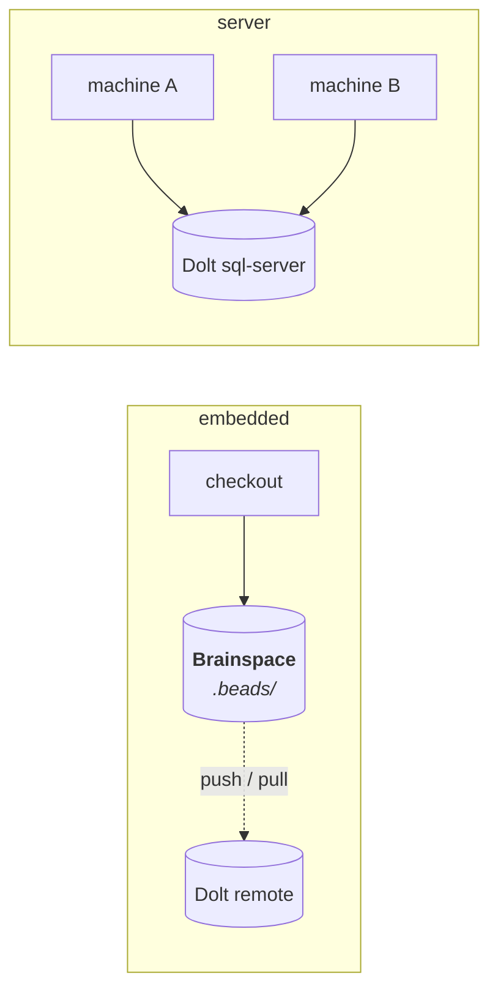
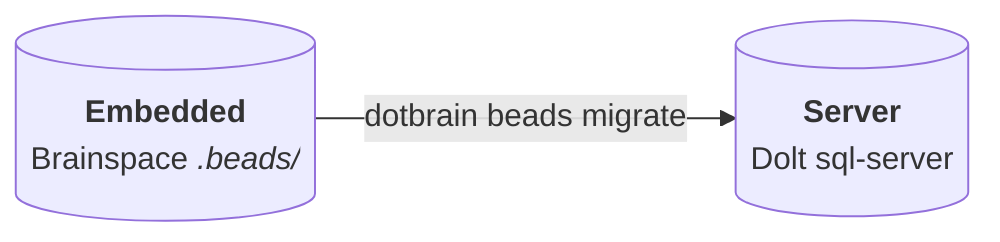

# Beads Backend

Dotbrain keeps each project's plans and tasks in [Beads](https://github.com/gastownhall/beads)
(`bd`), a dependency-aware issue tracker built on Dolt. This page covers the backend modes, how to
choose one, and the commands that manage them.

## Modes

| | `embedded` (default) | `server` | `none` |
| --- | --- | --- | --- |
| Where state lives | A local Dolt store in the Brainspace | A shared Dolt sql-server | Nowhere |
| Sync across machines | Optional, through a Dolt remote | Live | n/a |
| Setup | None | `beads.server` in `config.yaml` | None |
| Good for | Most projects | Several machines working at once | Projects tracked elsewhere, such as GitHub Issues |



If you are unsure, start `embedded`. Moving to `server` later keeps history.

## How Dotbrain Decides

Two files are involved:

- `~/dotbrain/config.yaml` holds machine-wide server defaults under `beads.server`.
- `.brain/project.yaml` picks the mode per project with `beads.mode`. Leaving it out uses
  `server` when a shared server host is configured, otherwise `embedded`.

```yaml
# .brain/project.yaml
beads:
  mode: server
  database: my_app_beads   # optional; defaults to the project name
```

See [Configuration](configuration.md) for the full shape.

## Server Mode

Point `config.yaml` at your sql-server once per machine:

```yaml
# ~/dotbrain/config.yaml
beads:
  server:
    host: db.example.internal
    port: 3307
    user: beads
    ssh_host: bastion.example.internal   # optional SSH hop, used by drop-db
```

::: warning
Never put passwords or tokens in `config.yaml`. Keep credentials in your secrets store.
:::

Then set `beads.mode: server` in the project and run `dotbrain wire` or `dotbrain beads sync`.

## Commands

### `beads sync`

Hydrates local tracker state from declarations: attaches server trackers, initializes embedded
ones, and pulls only when an embedded remote is declared. Disabled Beads is a no-op; a local
embedded tracker without a remote is prepared without a pull. Sync never pushes or changes wiring.

```bash
dotbrain beads sync --dry-run    # preview
dotbrain beads sync              # the current repo's project
dotbrain beads sync --all        # every Brainspace that uses beads
```

Run it on a fresh machine after cloning your dotbrain home.

Selection uses the wired Brainspace identity, including a worktree or nested directory. From
elsewhere, use `--project <name>`; `--home <path>` overrides the data root. Custom databases and
remote URLs come from declarations. A declared URL must match a named tracker remote; otherwise
sync reports an actionable error rather than pulling another remote. Configure a missing binding
with `bd dolt remote add <name> <declared-url>`, then repeat sync.

`--json` returns one result with per-project outcomes; independent targets continue after failures.
Tracker subprocess waits are bounded. Hydration, missing-tool, or pull failures exit unsuccessfully.

### `beads migrate`

Moves an embedded tracker onto the sql-server with its history.



```bash
dotbrain beads migrate --dry-run   # print the planned bd sequence
dotbrain beads migrate             # the current repo's project
dotbrain beads migrate --all       # every embedded Brainspace
```

Migration keeps the full Dolt history, embedded data, and a backup for rollback. It verifies issue
counts before reporting a verified migration and preserves unrelated project configuration. Target
connection overrides use `--server-host`, `--server-port`, and `--server-user`; `--database` is a
single-project override. Named selection respects the declared custom database when no override
is supplied.

### Cleaning Up

`dotbrain beads list-db` lists the databases on the server. `dotbrain beads drop-db` removes one.

```bash
dotbrain beads list-db --server-host db.example.internal --json
dotbrain beads drop-db orphaned_tracker --server-host db.example.internal --dry-run
dotbrain beads drop-db orphaned_tracker --server-host db.example.internal --yes
```

Database arguments are identifiers, not project selectors; orphaned databases remain manageable.
Dropping requires `--yes` or a preview and rejects unsafe or protected names. The same connection
options apply to administration; `--ssh-host` adds an optional SSH hop.

::: danger
`drop-db` deletes the remote database and every issue in it. It is separate from `dotbrain unwire`
on purpose: `unwire` disconnects a repo, `drop-db` destroys tracker data.
:::

## Working With the Tracker

Agents drive Beads through the `operate-execution` skill, but you can use `bd` directly in any wired
repo:

```bash
bd ready              # issues with no open blockers
bd show <id>          # one issue with its dependencies
bd list --status open
```
