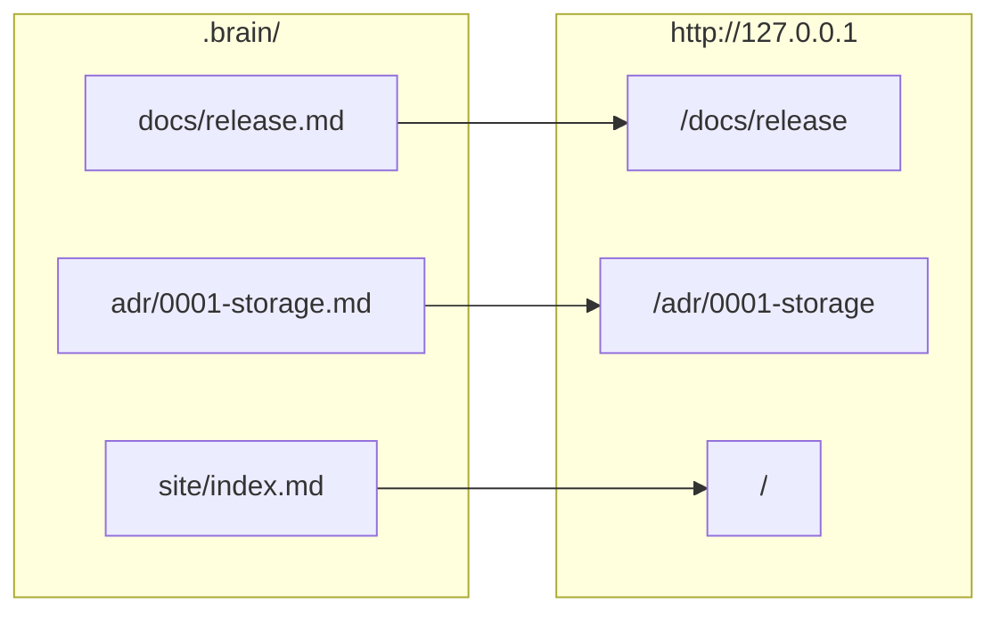

# Brain Site

`dotbrain site` renders a Brain as a private documentation site: every Markdown file becomes a
page, with search, a sidebar, and Mermaid diagrams. It is served on `127.0.0.1` only and never
published.

## Requirements

- Node.js 22.12 or later, with `npm` on `PATH`.
- A wired project, or `--name <project>` when you run commands from elsewhere.

The site engine is installed once per dotbrain version into `~/dotbrain/.cache/site/`. Nothing is
written into the Brain except the `.brain/site/` folder.

## Set It Up

```bash
dotbrain site init     # create .brain/site/ with site.yaml, a home page, and the manual
dotbrain site dev      # serve with live reload
```

`site init` lists every page in `docs/` in the sidebar. Trim it to what you read often.

## How Pages Map to URLs

Pages are served at their path in the Brain, so a relative link that works in the Brain works on
the site.



ADRs show their `status` and design docs their `lifecycle` as a badge above the page. Symlinks and
files with `[brackets]` in their names are skipped.

## The Sidebar

`.brain/site/site.yaml` decides what the sidebar lists. A page left out is still on the site,
reachable by links and search.

```yaml [.brain/site/site.yaml]
title: "My Brain"
description: Private project guidance
nav:
  - text: Runbooks
    items:
      - { text: Release, link: runbooks/release }        # docs/runbooks/release.md
      - { text: Deploy steps, link: "runbooks/deploy#steps" }
      - { text: Azure overview, link: deployment/azure/ } # its README.md or index.md
```

When the Brain has a `learning/` workspace, a Learn section is added above the nav automatically.

## Commands

| Command | Does |
| --- | --- |
| `dotbrain site init` | Creates `.brain/site/` with `site.yaml`, the home page, and the manual |
| `dotbrain site dev` | Serves with live reload; restart after editing `site.yaml` |
| `dotbrain site build` | Builds into dotbrain's cache, never into the Brain |
| `dotbrain site preview` | Serves the last build |

## What Fails the Build

- A nav item that links a missing page.
- A link on any page to a missing file, such as a renamed ADR. The error names the file and line.
- Invalid YAML frontmatter.
- A lesson whose `topic` is not listed in `learning/MISSION.md`.

Because agents edit the Brain too, the `brain-site` skill keeps every edit building and knows the
VitePress and Mermaid syntax pages can use.

## Changing the Look

- `.brain/site/theme/style.css` loads after the default styles.
- `.brain/site/theme/index.ts` can register Vue components through `enhanceApp`, or export a whole
  theme that extends `@dotbrain/theme`.

Theme files can import Vue, VitePress, Mermaid, and local files. A Brain cannot add npm packages.

The full manual is generated into every site as `.brain/site/configure.md`.
