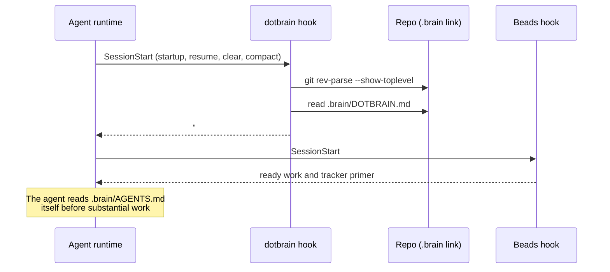

# Session Context

A wired repo's agent session starts with the dotbrain convention already in context. This page
explains what gets injected, how, and what the agent reads on its own.

## What Happens at Session Start

The plugin registers one `SessionStart` hook that runs `dotbrain hook session-start`. It fires on
startup, resume, `/clear`, and compaction, so the convention survives a context reset.

## What Is Injected

Only `.brain/DOTBRAIN.md`, the shared convention that dotbrain owns and keeps current through
`dotbrain refresh`. It covers wiring rules, where execution lives, the public/private boundary, and
how the Brain is laid out.

The project's own files are not injected:

| File | Loaded how |
| --- | --- |
| `.brain/DOTBRAIN.md` | Injected by the hook |
| `.brain/AGENTS.md` | Read by the agent; the convention tells it to |
| `.brain/CONTEXT.md`, `adr/`, `designs/` | Read by the agent when the work needs them |
| `.brain/docs/` | Searched by the agent before it answers how the project works |
| Beads ready work | Injected by the Beads project hook |

::: info Why not inject everything?
Agent runtimes cap hook output at roughly 10 KB. Past that, the output is written to a file and the
model sees none of it, convention included. `DOTBRAIN.md` has a bounded size; a project's
`AGENTS.md` grows with the project. Injecting only the convention keeps the session start reliable.
:::

## Failing Open

The hook never blocks a session. Outside a git repo, in a repo that is not wired, or when
`dotbrain` is not on `PATH`, it prints nothing and exits cleanly. The cost of that choice is that a
broken setup is silent: if a session in a wired repo does not know the convention, run
`dotbrain doctor`. See [Troubleshooting](troubleshooting.md#the-agent-does-not-know-the-project).

## Runtime Notes

- **Claude Code** runs the hook as soon as the plugin is installed.
- **Codex** runs plugin hooks only after you trust them: open `/hooks` in `codex`, trust the
  dotbrain hook, and start a new thread.
- In a runtime with no hook support, invoke the `dotbrain` skill to load the convention by hand.

## Subagents

`dotbrain bootstrap` and `dotbrain wire` also link four vendor-native subagents into each agent
workspace. Each one reads the Brain before it acts:

| Subagent | Does |
| --- | --- |
| `investigator` | Read-only investigation that answers a question with file-anchored facts |
| `implementer` | Carries out one small, already-scoped change end to end |
| `reviewer` | Reviews a change for correctness, regressions, security, and missing tests |
| `verifier` | Runs the verification gate and returns commit-stamped evidence, never an opinion |

Add project-only subagents under `subagents:` in [`project.yaml`](configuration.md#project-yaml).
