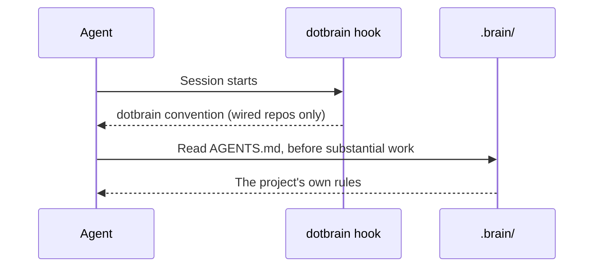

# Session Context

A wired repo's agent session starts with the dotbrain convention already in context. This page
explains what gets injected, how, and what the agent reads on its own.

## What Happens at Session Start

The plugin registers one `SessionStart` hook that runs `dotbrain hook session-start`. It fires on
startup, resume, `/clear`, and compaction, so the convention survives a context reset.

## What Is Injected

Only `.brain/DOTBRAIN.md`, the shared convention that dotbrain owns and keeps current through
`dotbrain refresh`. It covers wiring rules, where execution lives, the public/private boundary, and
how the Brain is laid out.

The project's own files are not injected:

| File | Loaded how |
| --- | --- |
| `.brain/DOTBRAIN.md` | Injected by the hook |
| `.brain/AGENTS.md` | Read by the agent; the convention tells it to |
| `.brain/CONTEXT.md`, `adr/`, `designs/` | Read by the agent when the work needs them |
| `.brain/docs/` | Searched by the agent before it answers how the project works |
| Beads workflow primer | Not injected by dotbrain; the agent runs `bd prime` when it needs it |

To have the Beads primer injected too, add Beads' own hook with `bd setup claude` or
`bd setup codex`. Dotbrain does not install it.

::: info Why not inject everything?
Dotbrain tests its session-start payload against a 10,000-byte budget. This budget comes from
measured Claude Code behavior: 9,961 bytes reached the model, while 10,010 bytes were written to
a file instead. It is not a verified limit for every runtime. `DOTBRAIN.md` has a bounded size;
a project's `AGENTS.md` grows with the project. Injecting only the convention keeps the payload
within that budget.
:::

## Failing Open

The hook never blocks a session. Outside a git repo, in a repo that is not wired, or when
`dotbrain` is not on `PATH`, it prints nothing and exits cleanly. The cost of that choice is that a
broken setup is silent: if a session in a wired repo does not know the convention, run
`dotbrain doctor`. See [Troubleshooting](troubleshooting.md#the-agent-does-not-know-the-project).

## Runtime Notes

- **Claude Code** runs the hook as soon as the plugin is installed.
- **Codex** runs plugin hooks only after you trust them: open `/hooks` in `codex`, trust the
  dotbrain hook, and start a new thread.
- In a runtime with no hook support, invoke the `dotbrain` skill to load the convention by hand.

## Subagents

See [Working with an agent team](agent-team.md#the-packaged-subagents) for when to use each role,
example prompts, and how the lead coordinates their results.

dotbrain ships packaged subagents. Claude Code receives them from the plugin as
`dotbrain:<role>`, for example `dotbrain:worker`. Codex has no plugin agents, so `dotbrain wire`
generates them into each wired checkout as `dotbrain-<role>`, for example `dotbrain-worker`.
Each reads the Brain before acting:

| Subagent | Does |
| --- | --- |
| `worker` | The writing worker: carries out an assigned change in your checkout or its own worktree, and commits it |
| `reviewer` | Reviews a change for correctness, regressions, security, and missing tests |
| `verifier` | Runs the verification gate and returns commit-stamped evidence, never an opinion |
| `researcher` | Answers a question from the Brain, the codebase, and the web, and flags where outside sources and the Brain disagree. On Codex it reads local files with shell commands under the lead session's permissions; its instructions forbid writes and network commands, but a lead with broader permissions passes them to it |

The packaged subagents can't be overridden: a file with the same name in your private agent
sources is ignored. To customize one, write your own agent under a different name. Add your own
subagents under `subagents:` in [`project.yaml`](configuration.md#project-yaml), or under
`global:` in `agents/agents.yaml`; `dotbrain bootstrap` prepares the global ones in your runtime homes.

Your own Claude definitions are delivered as symlinks. Codex definitions are real TOML copies
generated with `# dotbrain-managed-agent: v1`; dotbrain can overwrite or prune them. `dotbrain agents link` reconciles the current wired checkout;
use `--scope global` for global homes. Doctor checks file type and delivered content, while a
successful role spawn confirms the runtime actually consumed a definition.
