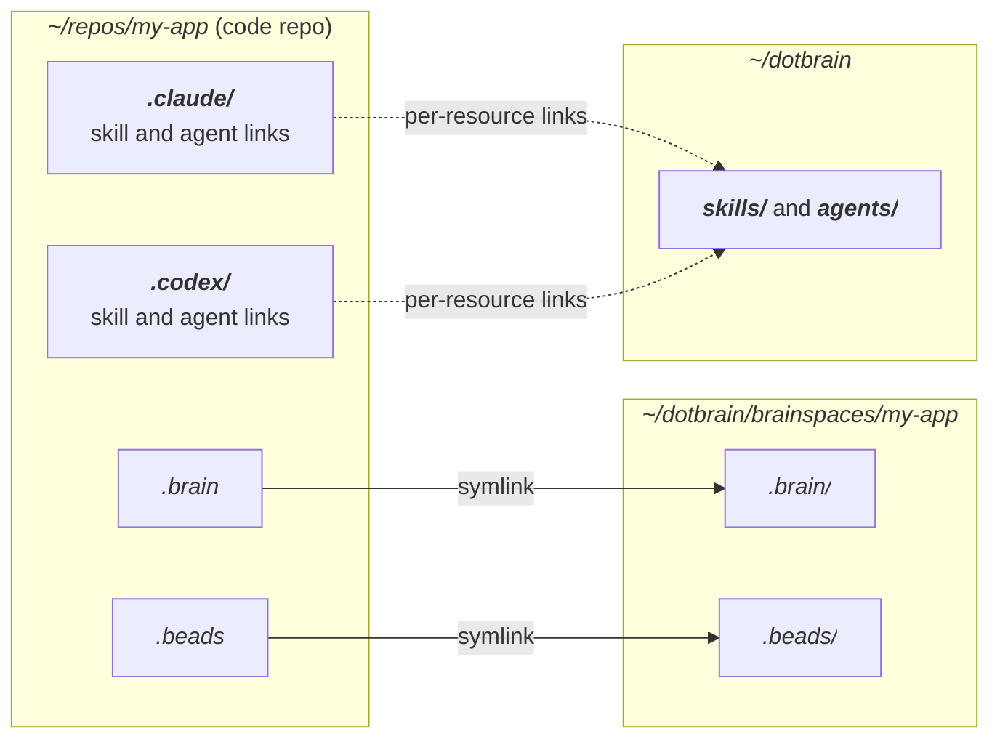
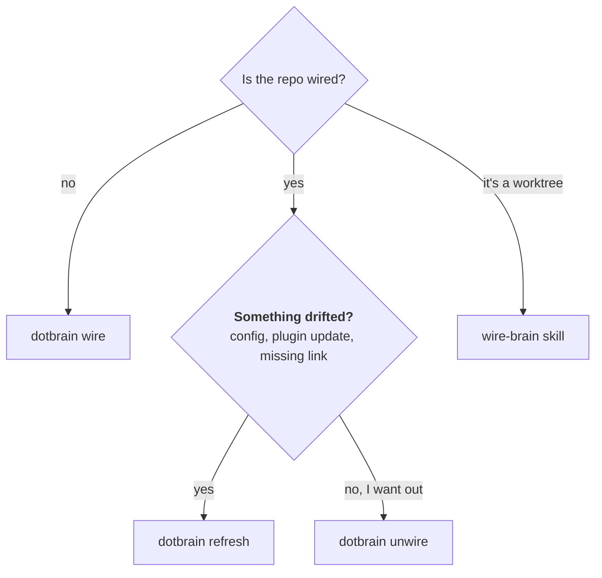

# Wiring

Wiring connects a code repo to a private Brainspace. This page covers what gets linked, what stays
private, and when to use `wire`, `refresh`, or `unwire`. For a first run, start with
[Getting started](getting-started.md).

## What Gets Linked



| Entry | Kind | Points at |
| --- | --- | --- |
| `.brain` | Symlink | The Brainspace's Brain |
| `.beads` | Symlink | The Brainspace's execution store |
| `.claude/`, `.codex/` | Real directories | Contain individually ignored links to selected skills and subagents |

`.claude` and `.codex` stay real directories so anything the project already keeps there (settings,
commands) is untouched. Dotbrain adds one ignore rule per link it creates and never claims files it
did not create.

Brainspaces live under `~/dotbrain/brainspaces/<name>/`. An older `~/dotbrain/projects/<name>/`
layout is still recognized; new Brainspaces are created under `brainspaces/`.

## Which Command to Use



## `wire`

Connects a repo for the first time, or reconciles it again from the source of truth.

::: code-group

```bash [From the repo]
cd ~/repos/my-app
dotbrain wire
```

```bash [From anywhere]
dotbrain wire --repo ~/repos/my-app
```

```bash [Every project]
dotbrain wire --all
```

```bash [Brain only]
dotbrain wire --no-repo --name research
```

:::

`wire` creates or repairs:

- the private Brainspace, seeded from the Brain template
- the repo-root `.brain` and `.beads` links and their ignore rules
- the project's `project.yaml`
- skill and subagent links in each agent workspace listed under `agents:`
- the Beads tracker, unless you pass `--skip-beads`

The Brainspace name defaults to the repo's directory name; pass `--name` to choose another.

## `refresh`

Repairs or resyncs an already wired project without treating it as a fresh connect.

```bash
dotbrain refresh                 # the current repo
dotbrain refresh --name my-app   # one project, from anywhere
dotbrain refresh --all           # every project
```

Run it after you:

- edit `project.yaml`
- update the plugin or CLI, so dotbrain-owned files such as `DOTBRAIN.md` are current
- notice a missing link or workspace file
- want the latest execution state pulled into a checkout

## `unwire` {#unwire}

Disconnects a repo from its Brainspace. By default the Brainspace is kept.

```bash
dotbrain unwire --dry-run        # preview first
dotbrain unwire                  # disconnect, keep the Brainspace
dotbrain unwire --archive        # move it to ~/dotbrain/.archive/
dotbrain unwire --delete         # remove it
```

::: warning
`--delete` removes the Brainspace, including its Brain. Commit or push your dotbrain home first if
you might want it back.
:::

`unwire` never touches a remote Beads database. For a server-backed project, dropping that database
is a separate step: [`dotbrain beads drop-db`](beads-backend.md#cleaning-up).

## Worktrees

A worktree shares the main checkout's Brain and execution store; it never gets its own. When a
worktree is missing `.brain` or `.beads`, ask your agent to run `wire-brain`. Its worktree branch
derives the main checkout from Git and links only those two entries, then links skills and
subagents into the worktree's `.claude` and `.codex`.

::: danger Do not hand-create links
Links under `.claude` and `.codex` use relative targets computed from the checkout's real location.
A hand-counted `../` depth dangles without any error.
:::

## Troubleshooting

```bash
dotbrain doctor     # read-only: what is missing or drifted
dotbrain refresh    # repair a wired project
dotbrain wire       # reconnect if the relationship changed
```

More in [Troubleshooting & FAQ](troubleshooting.md).
