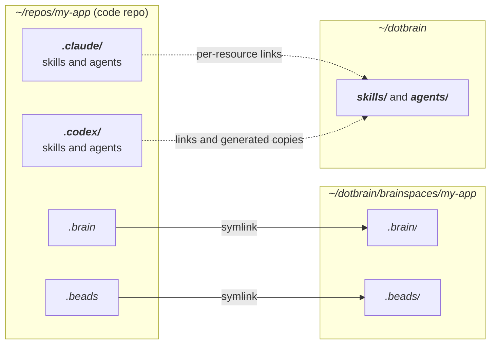
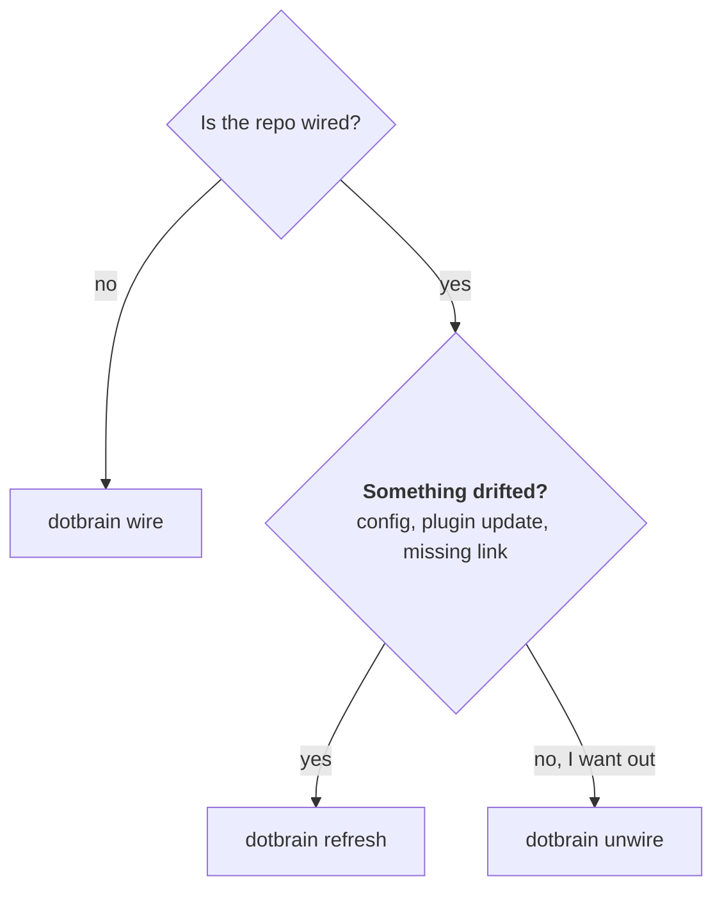

# Wiring

Wiring connects a code repo to a private Brainspace. This page covers what gets linked, what stays
private, and when to use `wire`, `refresh`, or `unwire`. For a first run, start with
[Getting started](getting-started.md).

## What Gets Linked



| Entry | Kind | Points at |
| --- | --- | --- |
| `.brain` | Symlink | The Brainspace's Brain |
| `.beads` | Symlink | The Brainspace's execution store |
| `.claude/`, `.codex/` | Real directories | Contain individually ignored selected runtime resources |

`.claude` and `.codex` stay real directories so anything the project already keeps there (settings,
commands) is untouched. Skills and Claude agents are symlinks. Codex agents are generated real
TOML files, marked `# dotbrain-managed-agent: v1`. Dotbrain can overwrite and prune its marked
copies; customize their source in the private home. Unmarked files and foreign links are preserved.
Each delivered resource is ignored individually.

Brainspaces live under `~/dotbrain/brainspaces/<name>/`. An older `~/dotbrain/projects/<name>/`
layout is still recognized; new Brainspaces are created under `brainspaces/`.

## Which Command to Use



## `wire`

Creates a Brainspace or attaches a checkout, including a linked Git worktree.

::: code-group

```bash [From the repo]
cd ~/repos/my-app
dotbrain wire
```

```bash [From anywhere]
dotbrain wire --repo ~/repos/my-app
```

```bash [Brain only]
dotbrain wire --no-repo --project research
```

:::

`wire` creates or repairs:

- the private Brainspace, seeded from the Brain template
- the repo-root `.brain` and `.beads` links and their ignore rules
- the project's `project.yaml`
- selected skills and subagents in each workspace listed under `agents:`
- the Beads tracker, unless you pass `--skip-beads`

For an initial main-checkout attachment, the Brainspace name defaults to the repo's directory
name; pass `--project` to choose another. Maintenance uses the existing wiring's identity.

## `refresh`

Repairs or resyncs an already wired project without treating it as a fresh connect.

```bash
dotbrain refresh                 # the current repo
dotbrain refresh --project my-app   # one project, from anywhere
dotbrain refresh --all           # every project
```

Run it after you:

- edit `project.yaml`
- update the plugin or CLI, so dotbrain-owned files such as `DOTBRAIN.md` are current
- notice a missing link or workspace file
- want the latest execution state pulled into a checkout

## `unwire` {#unwire}

Detaches the selected checkout and keeps its Brainspace and shared tracker.

```bash
dotbrain unwire                          # current wired checkout
dotbrain unwire --repo ~/repos/my-app     # explicit checkout
dotbrain unwire --project my-app         # registered checkout
```

User-owned workspace files, main-checkout registration, and other worktrees remain. Shared Git
exclusion entries are retained while another wired checkout needs them. Archive, restore, or
delete Brainspace directories through your own filesystem workflow; detachment does none of these.

`unwire` never touches a remote Beads database. For a server-backed project, dropping that database
is a separate step: [`dotbrain beads drop-db`](beads-backend.md#cleaning-up).

## Worktrees

A worktree shares the main checkout's Brain and execution store. `dotbrain wire` resolves the
main checkout through Git metadata and connects directly to its existing Brainspace. Missing or
conflicting main-checkout wiring fails rather than creating a project named after the worktree.

```bash
cd ~/repos/my-app-feature
dotbrain wire
dotbrain doctor
dotbrain refresh
dotbrain unwire
```

Attachment creates real local runtime directories, preserves project-owned files, and leaves the
main-checkout registration and declarations unchanged. It does not reseed the shared Brain or sync
the tracker; the worktree shares both with its main checkout, and `refresh` maintains them. Bare maintenance and asset linking inside
the wired worktree affect that checkout; refresh also maintains shared Brain conventions and
tracker state. Named selection and `--all` use registered checkouts rather than sweeping worktrees.

## Selection and reports

Project commands default to the current wired checkout, including its subdirectories. Outside
one, use `--project <name>`. Named selection respects `.repo.local` before `.repo`; Brain-only
projects are valid for operations that do not need a checkout. Use `dotbrain projects list` and
`dotbrain projects show` to inspect identities and resolved settings without remote probes.

`--all` conflicts with `--project` and `--repo`. Applicable leaf commands accept `--home <path>`
and `--json`. JSON is one finite result, retaining per-project outcomes in a partial batch;
exit codes are 0 for success, 1 for an unmet operation, and 2 for invalid selection or invocation.
Runtime filters select declared runtimes and never enable an undeclared workspace.

::: danger Do not hand-create links
Links under `.claude` and `.codex` use relative targets computed from the checkout's real location.
A hand-counted `../` depth dangles without any error.
:::

## Troubleshooting

```bash
dotbrain doctor     # read-only: what is missing or drifted
dotbrain refresh    # repair a wired project
dotbrain wire       # reconnect if the relationship changed
```

More in [Troubleshooting & FAQ](troubleshooting.md).
