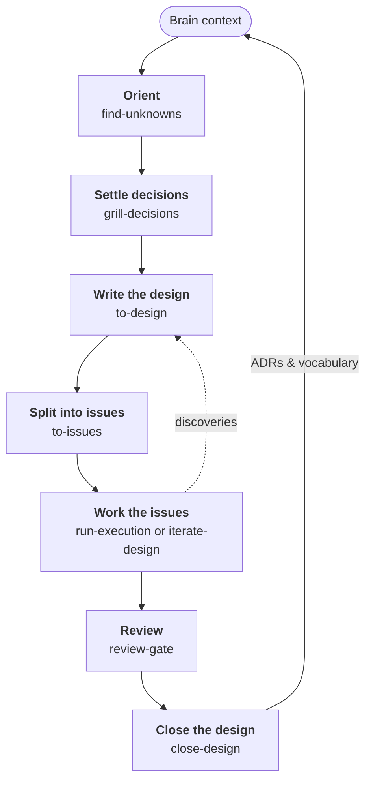
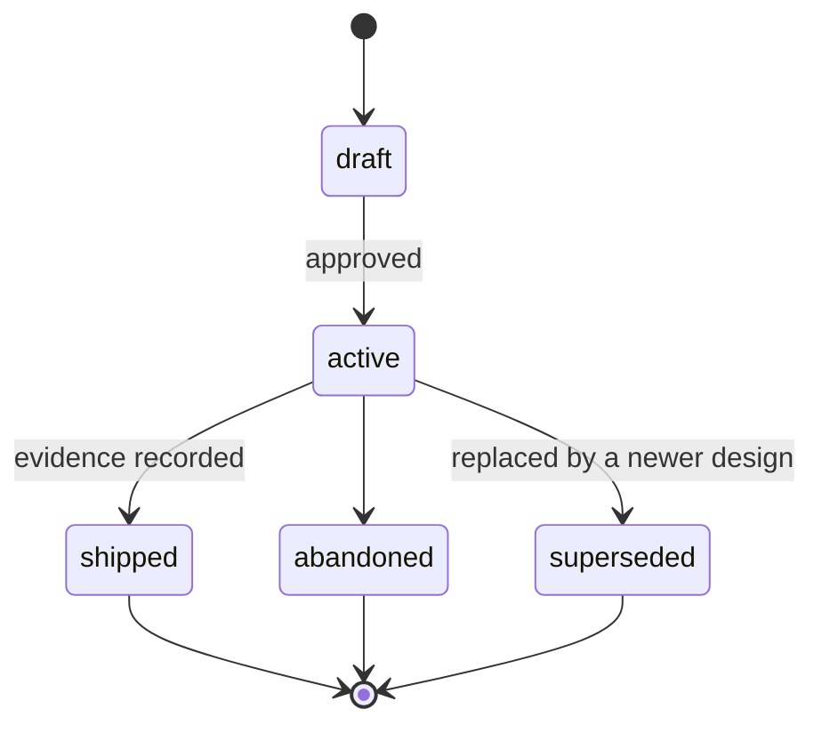

# The Workflow

Dotbrain gives agents a place to keep what they learn. This page follows one piece of work from a
first idea to a closed design, and names the skill that handles each step.

None of the steps are mandatory. A one-line fix needs only the Brain context that loads at session
start. The full loop pays off when work spans several sessions, touches unfamiliar code, or carries
open questions.

## The Loop at a Glance



<ol class="flow-steps">
<li><a href="#_1-orient"><strong>Orient</strong><code>find-unknowns</code></a></li>
<li><a href="#_2-settle-decisions"><strong>Settle decisions</strong><code>grill-decisions</code></a></li>
<li><a href="#_3-write-the-design"><strong>Write the design</strong><code>to-design</code></a></li>
<li><a href="#_4-split-into-issues"><strong>Split into issues</strong><code>to-issues</code></a></li>
<li><a href="#_5-work-the-issues"><strong>Work the issues</strong><code>manage-work-graph</code><code>run-execution</code><code>iterate-design</code></a></li>
<li><a href="#_6-review"><strong>Review</strong><code>review-gate</code></a></li>
<li><a href="#_7-close-the-design"><strong>Close the design</strong><code>close-design</code></a></li>
</ol>


Two loops close the circle: discoveries during the work flow back into the design, and closing a
design feeds its decisions back into the Brain.

Each step hands off through a file or a tracker entry, not through chat history. A new session can
pick up at any step because the state it needs is in the Brain or in Beads.

## 1. Orient

Ask the agent to run `find-unknowns` before touching unfamiliar code. It reads the area against the
Brain and reports what would change your approach: missing vocabulary, assumptions the code does not
support, constraints nobody wrote down.

```text
Run find-unknowns on the payment retry path before we change it.
```

## 2. Settle Decisions

`grill-decisions` interviews you about a plan, one branch at a time, against the project's existing
vocabulary and decisions. When something settles, it is written down as it settles:

- a new or sharpened term goes into `CONTEXT.md`
- a hard-to-reverse choice with a real trade-off becomes an ADR in `adr/`

## 3. Write the Design

`to-design` turns the settled shape into a design doc in `.brain/designs/` and opens a tracking epic
in Beads. While the design is active it is the living authority for the initiative: the approach,
success criteria, known unknowns, and any deviation found during the build.

A design moves through a fixed set of states:



Only `draft` and `active` designs change. A terminal design is a point-in-time record.

## 4. Split Into Issues

`to-issues` decomposes the design into vertical-slice issues under its epic, each with acceptance
criteria and `blocks` dependencies. "What can I work on next" is then a query instead of a document:

```bash
bd ready
```

## 5. Work the Issues

`manage-work-graph` keeps the work graph: it files, links, and claims issues and closes them when
their criteria hold. `run-execution` does the work for one issue or a fixed batch: it dispatches
workers, has each change reviewed, integrates the results, runs the checks, and stops at a retry
limit or a human decision. When the build reveals something the design did not expect, the
discovery is written back into the design and the affected issues, so the next session sees it.

Each run makes two independent choices: who drives, and how many agents write at once.

| | Sequential | Parallel |
|---|---|---|
| **Human-in-the-loop**: you direct each step | One agent writes at a time, usually your own session. | Workers take independent issues at once, each in its own worktree. |
| **Handoff**: the agent continues within a contract you approve | `iterate-design` works the issues one at a time. | `iterate-design` runs independent issues side by side. |

The agent runs issues in parallel only when they are ready together, touch different files, and
share no build outputs, databases, or ports. When you are directing the work, it tells you the
split before starting, and you can change it.

Either way, the work happens on a dedicated branch and reaches `main` through a pull request you
review. The agent asks before pushing or opening that pull request, and lands work directly on
`main` only when you tell it to.

**Or hand it off.** For an unattended run against an active design, `iterate-design` drives the
agent's loop mode with a mechanical verifier and a hard stop. You approve a contract first: the
scope, the branch, the checks, how many workers may run at once, and how the pull request is
delivered. Then:

- At its first push it opens a draft pull request, and it pushes again after each finished issue.
- When an issue fails its checks three times in a row, or needs your decision, only that issue and
  the issues waiting on it stop. Independent issues continue.
- When the run stops blocked, it mentions you on the pull request, so you are notified.
- When everything is done and reviewed, it marks the pull request ready and requests your review.
  Merging stays with you.

## 6. Review

Reviews happen at two levels:

- **Each issue.** Every change to code, tests, build or CI config, or agent instructions gets an
  independent review before its issue closes, from a reviewer agent that wrote none of it. The
  reviewer approves or asks for changes, the same agent fixes its own work, and three requests for
  changes in a row stop the issue for your decision. Changes to prose alone are exempt. When you
  are directing the work, the agent may ask whether a small change needs a review, and says what
  it recommends.
- **The branch.** Before a branch carrying several issues is offered for merge, a fresh reviewer
  checks the whole diff: how the issues fit together and whether they match the design. A handoff
  also runs a simplification pass. Its suggestions never block the pull request; you decide on
  them alongside it.

`review-gate` runs these reviews in focused modes (correctness, simplification, or readiness) and
records each outcome in the tracker. The agent never closes a review on its own judgment: it closes
a code review's record once it sees you merge the reviewed pull request, and every other review
waits for you.

## 7. Close the Design

`close-design` moves the design to a terminal state. It records the evidence that the success
criteria were met, promotes what should outlive the initiative into `adr/` and `CONTEXT.md`, and
closes the epic. The next initiative starts with those decisions already in the Brain.

::: tip Who owns what
Agents write to the Brain freely, and every change is a commit in your dotbrain home, so it can be
reviewed and reverted. Success criteria are the exception: an agent can propose a change to them,
but only you approve it.
:::

## Related

- [Skills](skills.md) lists every skill with a one-line summary.
- [Architecture](architecture.md) explains why the Brain and the tracker are separate.
