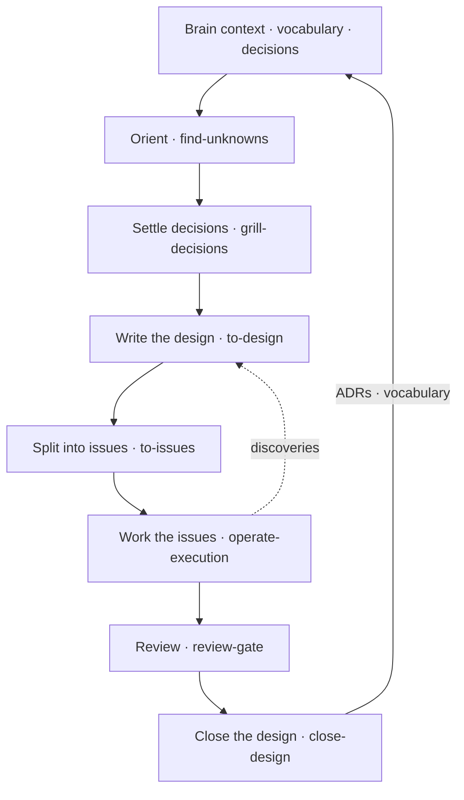
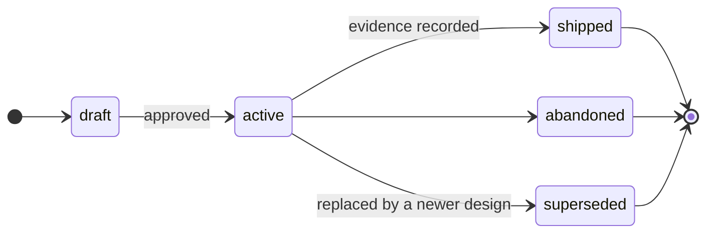

# The Workflow

Dotbrain gives agents a place to keep what they learn. This page follows one piece of work from a
first idea to a closed design, and names the skill that handles each step.

None of the steps are mandatory. A one-line fix needs only the Brain context that loads at session
start. The full loop pays off when work spans several sessions, touches unfamiliar code, or carries
open questions.

## The Loop at a Glance



Each arrow is a hand-off through a file or a tracker entry, not through chat history. A new session
can pick up at any box because the state it needs is in the Brain or in Beads.

## 1. Orient

Ask the agent to run `find-unknowns` before touching unfamiliar code. It reads the area against the
Brain and reports what would change your approach: missing vocabulary, assumptions the code does not
support, constraints nobody wrote down.

```text
Run find-unknowns on the payment retry path before we change it.
```

## 2. Settle Decisions

`grill-decisions` interviews you about a plan, one branch at a time, against the project's existing
vocabulary and decisions. When something settles, it is written down as it settles:

- a new or sharpened term goes into `CONTEXT.md`
- a hard-to-reverse choice with a real trade-off becomes an ADR in `adr/`

## 3. Write the Design

`to-design` turns the settled shape into a design doc in `.brain/designs/` and opens a tracking epic
in Beads. While the design is active it is the living authority for the initiative: the approach,
success criteria, known unknowns, and any deviation found during the build.

A design moves through a fixed set of states:



Only `draft` and `active` designs change. A terminal design is a point-in-time record.

## 4. Split Into Issues

`to-issues` decomposes the design into vertical-slice issues under its epic, each with acceptance
criteria and `blocks` dependencies. "What can I work on next" is then a query instead of a document:

```bash
bd ready
```

## 5. Work the Issues

`operate-execution` claims an issue, updates it as work proceeds, and closes it when its criteria
hold. When the build reveals something the design did not expect, the discovery is written back
into the design and the affected issues, so the next session sees it.

For an unattended run against an active design, `iterate-design` drives the agent's loop mode with
a mechanical verifier and a hard stop. It runs on a dedicated branch and stops at a draft pull
request; merging stays with you.

## 6. Review

`review-gate` runs a focused review (correctness, simplification, or readiness) and records the
outcome on the issue. The agent records the result but does not close its own review; that call is
yours.

## 7. Close the Design

`close-design` moves the design to a terminal state. It records the evidence that the success
criteria were met, promotes what should outlive the initiative into `adr/` and `CONTEXT.md`, and
closes the epic. The next initiative starts with those decisions already in the Brain.

::: tip Who owns what
Agents write to the Brain freely, and every change is a commit in your dotbrain home, so it can be
reviewed and reverted. Success criteria are the exception: an agent can propose a change to them,
but only you approve it.
:::

## Related

- [Skills](skills.md) lists every skill with a one-line summary.
- [Architecture](architecture.md) explains why the Brain and the tracker are separate.
