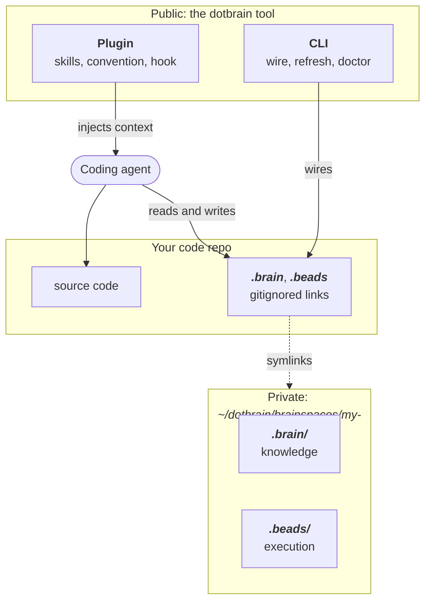
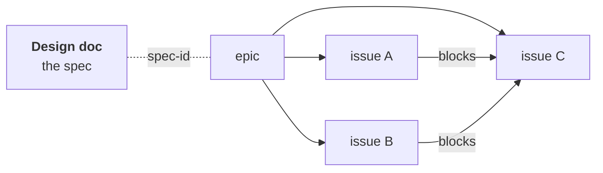

# 架构

本页解释 dotbrain 的设计：Brainspace、Brain 与执行的分离、技能，以及公开/私有的边界。

## 全局视图 {#the-big-picture}

三个部分，三个归属：

- **工具**是公开的，对所有人都一样。
- **dotbrain 主目录**是你自己的，私有。它存放所有项目的 Brainspace，作为一个 Git 仓库统一做版本管理。
- **代码仓库**还是原来的代码仓库，只是多了被忽略的本地连接和生成的运行时资源。

## Brainspace {#brainspaces}

**Brainspace** 是每个项目一个的目录，存放 Agent 需要、但不属于代码本身的一切：

- `.brain/` 是项目的知识。
- `.beads/` 是执行存储：任务、依赖和计划。

代码仓库通过被 gitignore 的 `.brain` 和 `.beads` 符号链接访问它的 Brainspace。仓库里的 `.claude` 和
`.codex` Agent 工作区是真实目录；dotbrain 往里面添加逐个被忽略的技能链接、Claude Agent 链接和带标记的
Codex Agent 文件，不会占用项目自己的文件。Agent 看到的是一棵完整的目录树，仓库保持干净，上下文保持私有。
细节见[项目连接](wiring.md)。

## Brain {#the-brain}

Brain 里的每个部分各有一个用途：

| 部分 | 内容 | 何时变化 |
| --- | --- | --- |
| `CONTEXT.md` | 领域术语：任务、计划和代码里用的名字 | 一个概念被命名或定义得更精确时 |
| `adr/` | 架构决策记录（ADR），每个决策一条 | 做出一个难以撤回、有真实取舍的选择时 |
| `designs/` | 设计文档，每项工作一个文件 | 一项工作被规划、实现或结束时 |
| `AGENTS.md` | 本项目的 Agent 约定 | 工作规则变化时 |
| `DOTBRAIN.md` | 共享约定，由 dotbrain 维护 | `dotbrain refresh` 更新它时 |
| `project.yaml` | 运行时、任务跟踪、技能和子 Agent 的选择 | 你改变项目使用的东西时 |
| `docs/` | 派生的操作手册和参考资料 | 随时；从不作为权威依据 |
| `learning/` | 可选的个人学习工作区 | 你用 `teach-me` 学习项目时 |

ADR 记录的是难以撤回、没有上下文会让人意外、并且经过真实取舍的决策。**active** 的设计是这项工作的
权威依据；一旦变成 **shipped**、**abandoned** 或 **superseded**，它就冻结为一份记录，需要长期保留的内容
转移到 `adr/` 和 `CONTEXT.md`。[工作流程](workflow.md)介绍了这个生命周期。

对 Brain 的写入都是 dotbrain 主目录里的提交，所以每次改动都可以审阅和撤回。

## 执行状态放在任务跟踪里 {#execution-lives-in-the-tracker}

计划和任务不放在会过时的 Markdown 清单里，而是放在**执行存储**中，默认是
[Beads](https://github.com/gastownhall/beads)，一个能感知依赖关系的任务跟踪工具。多步骤的工作是一个带
`blocks` 依赖的 epic，所以“哪些可以开始做”只是一次查询：

设计说明要去哪里，任务跟踪说明现在在哪里。执行存储是按配置同步的本机运行时状态，所以同一个项目可以
在一台机器上用 embedded 模式运行，在另一台机器上连接共享服务器。详见 [Beads 后端](beads-backend.md)。

## 技能 {#skills}

技能是可复用的 Agent 能力，归工具所有，而不是归某个项目所有。插件自带与 Brain 配合的技能；dotbrain
只链接你自己选的全局技能和项目技能。

链接是幂等的：dotbrain 只创建和清理它自己的链接。它从不删除真实文件，也不删除不是它创建的链接，
所以内置技能可以和私有技能在同一台机器上并存。详见[技能](skills.md)。

## 会话开始 {#session-start}

运行一次 `dotbrain bootstrap` 准备好全局技能和子 Agent。之后，在已连接仓库里的每个 Agent 会话开始时，
插件的 hook 都会注入 dotbrain 约定，所以 Agent 一开始就知道 Brain 在哪、怎么用。
详见[会话上下文](session-context.md)。

## 公开/私有的边界 {#the-public-private-boundary}

决定一切的那个决策：**工具是公开的，你的数据是私有的。**

- 这个仓库就是工具：CLI、插件、技能、模板。
- 你的 Brainspace 放在一个单独的数据目录里，由安装好的工具来操作。
- 工具里从不包含项目数据，Brain 也从不被复制到代码仓库里。
- 需要公开某些内容时，你要为那些读者**重新写**一份文档，而不是把私有的原文公开出去。

正是这条边界，让同一个开源工具可以服务完全私有的工作。
