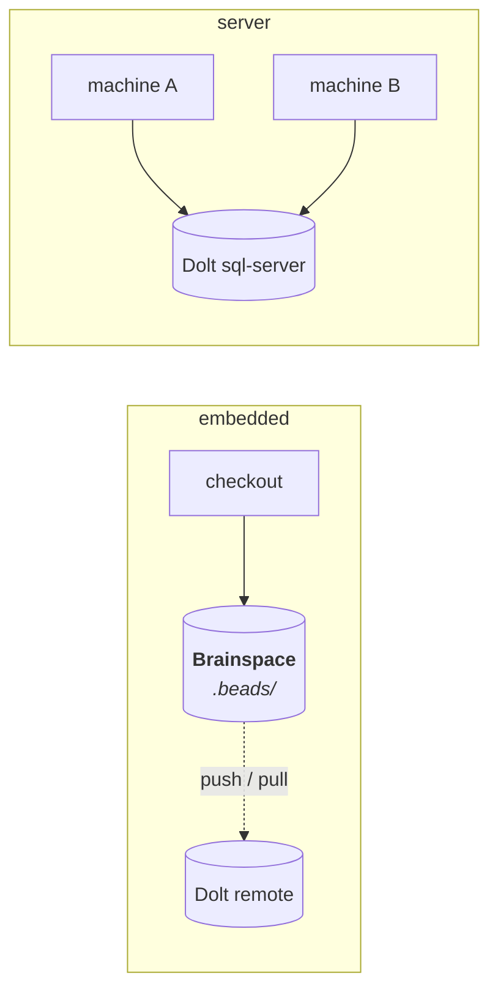
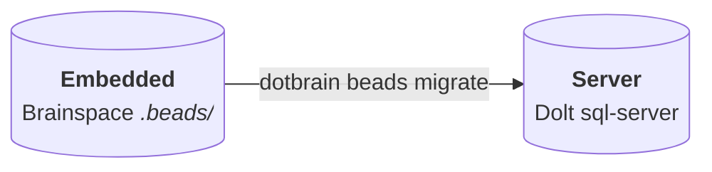

# Beads 后端

dotbrain 把每个项目的计划和任务放在 [Beads](https://github.com/gastownhall/beads)（`bd`）里，这是一个基于
Dolt、能感知依赖关系的任务跟踪工具。本页介绍后端模式、怎么选，以及管理它们的命令。

## 模式 {#modes}

| | `embedded`（默认） | `server` | `none` |
| --- | --- | --- | --- |
| 状态存在哪里 | Brainspace 里的本地 Dolt 存储 | 共享的 Dolt sql-server | 不存 |
| 跨机器同步 | 可选，通过 Dolt remote | 实时 | 不适用 |
| 配置 | 不需要 | `config.yaml` 里的 `beads.server` | 不需要 |
| 适合 | 大多数项目 | 多台机器同时工作 | 在别处跟踪任务的项目，比如 GitHub Issues |



拿不准就先用 `embedded`。以后换成 `server` 也会保留历史。

## dotbrain 怎么决定 {#how-dotbrain-decides}

涉及两个文件：

- `~/dotbrain/config.yaml` 在 `beads.server` 下存放整台机器的服务器默认配置。
- `.brain/project.yaml` 用 `beads.mode` 为每个项目选择模式。不写的话，配置了共享服务器主机就用 `server`，
  否则用 `embedded`。

```yaml
# .brain/project.yaml
beads:
  mode: server
  database: my_app_beads   # optional; defaults to the project name
```

完整格式见[配置](configuration.md)。

## server 模式 {#server-mode}

每台机器配置一次，让 `config.yaml` 指向你的 sql-server：

```yaml
# ~/dotbrain/config.yaml
beads:
  server:
    host: db.example.internal
    port: 3307
    user: beads
    ssh_host: bastion.example.internal   # optional SSH hop, used by drop-db
```

::: warning
不要把密码或 token 写进 `config.yaml`。凭据请放在你的密钥存储里。
:::

然后在项目里设置 `beads.mode: server`，再运行 `dotbrain wire` 或 `dotbrain beads sync`。

## 命令 {#commands}

### `beads sync`

按声明同步本地的任务跟踪状态：连接 server 模式的跟踪器，初始化 embedded 模式的跟踪器，只有声明了
embedded remote 时才会拉取。禁用 Beads 时什么都不做；没有 remote 的本地 embedded 跟踪器只做准备，
不拉取。sync 从不推送，也不改动连接。

```bash
dotbrain beads sync --dry-run    # preview
dotbrain beads sync              # the current repo's project
dotbrain beads sync --all        # every Brainspace that uses beads
```

在新机器上克隆好 dotbrain 主目录后运行它。

选择项目时使用已连接的 Brainspace 身份，在 worktree 或子目录里也一样。在别处请用 `--project <name>`；
`--home <path>` 可以覆盖数据目录。自定义数据库和 remote URL 来自声明。声明的 URL 必须对应跟踪器里一个
有名字的 remote；否则 sync 会报一个可以照着处理的错误，而不是去拉另一个 remote。缺少绑定时，用
`bd dolt remote add <name> <declared-url>` 配置，再重新运行 sync。

`--json` 返回一个包含每个项目结果的结果；某个目标失败后，互不相关的目标会继续。跟踪器子进程的等待时间
有上限。sync 失败、缺少工具或拉取失败时，以失败状态退出。

### `beads migrate`

把 embedded 跟踪器连同历史一起迁移到 sql-server。



```bash
dotbrain beads migrate --dry-run   # print the planned bd sequence
dotbrain beads migrate             # the current repo's project
dotbrain beads migrate --all       # every embedded Brainspace
```

迁移会保留完整的 Dolt 历史、embedded 数据，以及一份用于回滚的备份。报告迁移成功之前，它会核对任务数量，
并保留不相关的项目配置。目标连接可以用 `--server-host`、`--server-port` 和 `--server-user` 覆盖；
`--database` 只用于单个项目。按名字选择且没有覆盖时，会使用声明的自定义数据库。

### 清理 {#cleaning-up}

`dotbrain beads list-db` 列出服务器上的数据库，`dotbrain beads drop-db` 删除其中一个。

```bash
dotbrain beads list-db --server-host db.example.internal --json
dotbrain beads drop-db orphaned_tracker --server-host db.example.internal --dry-run
dotbrain beads drop-db orphaned_tracker --server-host db.example.internal --yes
```

数据库参数是标识符，不是项目选择器，所以孤立的数据库也能管理。删除需要 `--yes` 或预览，并会拒绝不安全或
受保护的名字。管理命令使用同样的连接选项；`--ssh-host` 可以加一个可选的 SSH 跳板。

::: danger
`drop-db` 会删除远程数据库及其中的每一个任务。它特意和 `dotbrain unwire` 分开：`unwire` 断开仓库，
`drop-db` 销毁任务数据。
:::

## 使用任务跟踪 {#working-with-the-tracker}

Agent 通过 `manage-work-graph` 技能操作 Beads，你也可以在任何已连接的仓库里直接用 `bd`：

```bash
bd ready              # issues with no open blockers
bd show <id>          # one issue with its dependencies
bd list --status open
```

只有条目的负责人才能关闭、释放或重新分配它。要关闭别人持有的条目，请以对方的身份关闭，并在原因里写上自己的名字：

```bash
bd close <id> --actor <assignee> --reason "<reason> (closed by <you>)"
```

避免使用 `bd close --force`，它还会跳过关卡和未关闭的子项。

## 升级 `bd` {#upgrading-bd}

dotbrain 在 `bd` 1.3.1 上验证过；如果 `PATH` 上是更旧的版本，`dotbrain doctor` 会给出警告。
从 1.2.x 升级之前，先用现有版本导出每个跟踪器：

```bash
bd export --all -o <backup>.jsonl
```

embedded 跟踪器在第一次使用时会自动迁移 schema。共享服务器不会：先在每台使用该服务器的机器上升级 `bd`，
再对每个数据库运行一次 `bd migrate schema`。在此之前，服务器会拒绝 `bd dolt pull` 和 `bd dolt push`。
