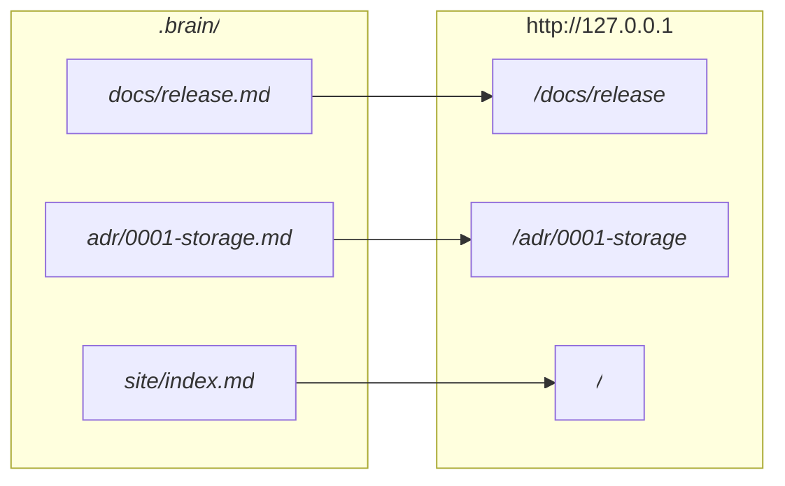

# Brain 站点配置

阅读、搜索、导航和私有知识的使用场景，请看[浏览 Brain](brain-site.md)。

`dotbrain site` 把 Brain 渲染成一个私有的文档站点：每个 Markdown 文件都成为一个页面，带搜索、侧边栏和
Mermaid 图表。它只在 `127.0.0.1` 上运行，从不发布。

## 要求 {#requirements}

- Node.js 22.12 或更高版本，`PATH` 上要有 `npm`。
- 一个已连接的项目；在别处运行命令时用 `--project <project>`。

站点引擎每个 dotbrain 版本安装一次，装在 `~/dotbrain/.cache/site/`。除了 `.brain/site/` 文件夹，不会往 Brain
里写任何东西。

## 创建站点 {#set-it-up}

```bash
dotbrain site init     # create .brain/site/ with site.yaml, a home page, and the manual
dotbrain site dev      # serve with live reload
```

`site init` 会把 `docs/` 里的每个页面都列进侧边栏。把它删减到你常看的那些就好。

## 页面如何对应到 URL {#how-pages-map-to-urls}

页面按它在 Brain 里的路径提供访问，所以在 Brain 里能用的相对链接，在站点上也能用。



ADR 会在页面上方以标记显示它的 `status`，设计文档显示它的 `lifecycle`。符号链接和文件名里带 `[方括号]` 的
文件会被跳过。

## 侧边栏 {#the-sidebar}

`.brain/site/site.yaml` 决定侧边栏列出哪些内容。没列进去的页面仍然在站点上，可以通过链接和搜索访问。

```yaml
# .brain/site/site.yaml
title: "My Brain"
description: Private project guidance
nav:
  - text: Runbooks
    items:
      - { text: Release, link: runbooks/release }        # docs/runbooks/release.md
      - { text: Deploy steps, link: "runbooks/deploy#steps" }
      - { text: Azure overview, link: deployment/azure/ } # its README.md or index.md
```

如果 Brain 里有 `learning/` 工作区，导航上方会自动加一个 Learn 区域。

## 命令 {#commands}

| 命令 | 作用 |
| --- | --- |
| `dotbrain site init` | 创建 `.brain/site/`，包含 `site.yaml`、首页和使用手册 |
| `dotbrain site dev` | 带热更新运行；修改 `site.yaml` 后需要重启 |
| `dotbrain site build` | 构建到 dotbrain 的缓存里，从不构建到 Brain 里 |
| `dotbrain site preview` | 运行上一次的构建结果 |

命令默认作用于当前已连接的项目，在 worktree 或子目录里也一样。在别处请用 `--project <name>`，用
`--home <path>` 指定另一个私有数据目录。`site init` 和 `site build` 支持一次性的 `--json` 结果；
`site dev` 和 `site preview` 持续输出服务器日志，不支持 JSON 结果。

## 哪些情况会导致构建失败 {#what-fails-the-build}

- 导航项链接到不存在的页面。
- 任何页面里链接到不存在的文件，比如改了名的 ADR。错误信息会指出文件和行号。
- 无效的 YAML frontmatter。
- 格式错误的 HTML 或 Vue 标记，包括被当成标签解析的裸尖括号占位符。
- 课程的 `topic` 没有列在 `learning/MISSION.md` 里。

字面上的占位符请写成行内代码，表格里也一样：`--project <name>` 和 `--repo <path>`。原始 HTML 只用于有意的
标记。"Element is missing end tag" 错误可能意味着一个裸占位符被解析成了没闭合的标签；请检查错误提到的文件和行。

需要创建、修改或验证站点时，手动调用 `brain-site`。平常编辑 Brain 时可以直接查阅 VitePress 和 Mermaid
语法参考，不会因此自动运行站点操作。

## 修改外观 {#changing-the-look}

- `.brain/site/theme/style.css` 在默认样式之后加载。
- `.brain/site/theme/index.ts` 可以通过 `enhanceApp` 注册 Vue 组件，或者导出一个继承 `@dotbrain/theme` 的完整主题。

主题文件可以导入 Vue、VitePress、Mermaid 和本地文件。Brain 不能添加 npm 包。

完整的使用手册会以 `.brain/site/configure.md` 的形式生成到每个站点里。
