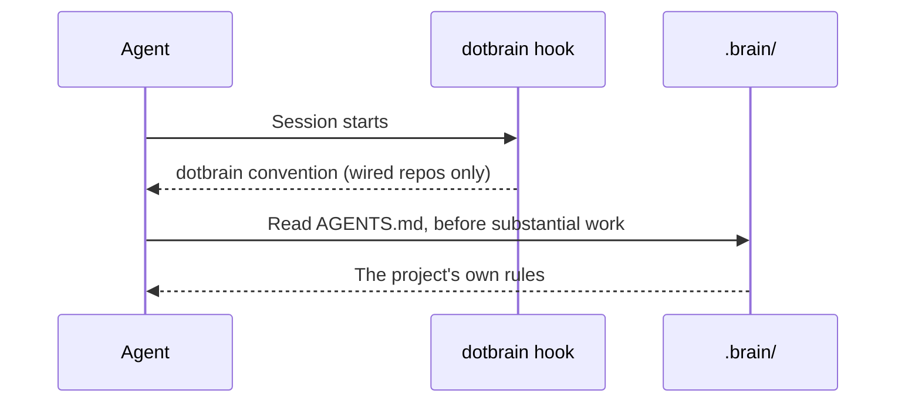

# 会话上下文

在已连接的仓库里，Agent 会话一开始，dotbrain 约定就已经在上下文里了。本页解释注入了什么、怎么注入的，
以及 Agent 会自己去读哪些内容。

## 会话开始时发生了什么 {#what-happens-at-session-start}

插件注册了一个 `SessionStart` hook，它运行 `dotbrain hook session-start`。这个 hook 在启动、恢复会话、
`/clear` 和上下文压缩时都会触发，所以约定在上下文重置后依然存在。

## 注入了什么 {#what-is-injected}

只有 `.brain/DOTBRAIN.md`，也就是由 dotbrain 维护、通过 `dotbrain refresh` 保持最新的共享约定。
它涵盖连接规则、执行状态放在哪里、公开/私有的边界，以及 Brain 的目录结构。

项目自己的文件不会被注入：

| 文件 | 加载方式 |
| --- | --- |
| `.brain/DOTBRAIN.md` | 由 hook 注入 |
| `.brain/AGENTS.md` | 由 Agent 读取，约定会告诉它这么做 |
| `.brain/CONTEXT.md`、`adr/`、`designs/` | 工作需要时由 Agent 读取 |
| `.brain/docs/` | Agent 在回答项目如何运作之前先搜索这里 |
| Beads 工作流入门 | dotbrain 不注入；Agent 需要时运行 `bd prime` |

如果也想注入 Beads 的入门说明，可以用 `bd setup claude` 或 `bd setup codex` 添加 Beads 自己的 hook。
dotbrain 不会安装它。

::: info 为什么不全部注入？
dotbrain 用 10,000 字节的预算测试会话启动时注入的内容。这个预算来自对 Claude Code 实际行为的测量：
9,961 字节到达了模型，而 10,010 字节则被写到了一个文件里。它不是在所有运行时上都验证过的上限。
`DOTBRAIN.md` 的大小是有上限的，而项目的 `AGENTS.md` 会随项目增长。只注入约定，就能让内容保持在预算以内。
:::

## 失败时放行 {#failing-open}

hook 从不阻塞会话。在 git 仓库之外、在没有连接的仓库里，或者 `PATH` 上没有 `dotbrain` 时，它什么都不输出，
正常退出。这样做的代价是，配置坏了也不会有提示：如果已连接仓库里的会话不知道约定，请运行
`dotbrain doctor`。见[故障排查](troubleshooting.md#the-agent-does-not-know-the-project)。

## 各运行时的说明 {#runtime-notes}

- **Claude Code** 装好插件后就会运行 hook。
- **Codex** 只在你信任插件 hook 之后才运行它们：在 `codex` 里打开 `/hooks`，信任 dotbrain 的 hook，
  然后新开一个 thread。
- 在不支持 hook 的运行时里，调用 `dotbrain` 技能手动加载约定。

## 子 Agent {#subagents}

dotbrain 自带一组子 Agent。Claude Code 从插件获得它们，名字是 `dotbrain:<role>`，比如 `dotbrain:worker`。
Codex 没有插件 Agent，所以 `dotbrain wire` 会把它们生成到每个已连接的 checkout 里，名字是 `dotbrain-<role>`，
比如 `dotbrain-worker`。它们在行动前都会先读 Brain：

| 子 Agent | 做什么 |
| --- | --- |
| `worker` | 负责写代码的 worker：在你的 checkout 或它自己的 worktree 里完成分配的改动，并提交 |
| `reviewer` | 审阅改动的正确性、回归、安全性和缺失的测试 |
| `verifier` | 运行验证关卡，返回带提交标记的证据，从不给主观意见 |
| `researcher` | 根据 Brain、代码库和网络回答问题，并指出外部来源和 Brain 不一致的地方。在 Codex 上，它在主会话的权限下用 shell 命令读取本地文件；它的指令禁止写入和网络命令，但如果主会话权限更宽，这些权限也会传给它 |

自带的子 Agent 不能被覆盖：你私有 Agent 源里同名的文件会被忽略。要自定义，请用不同的名字写你自己的 Agent。
在 [`project.yaml`](configuration.md#project-yaml) 的 `subagents:` 下，或 `agents/agents.yaml` 的 `global:`
下添加你自己的子 Agent；`dotbrain bootstrap` 会把全局的那些准备到各运行时的主目录里。

你自己的 Claude 定义以符号链接的形式分发。Codex 定义是生成的真实 TOML 副本，带有
`# dotbrain-managed-agent: v1` 标记；dotbrain 可以覆盖或清理它们。`dotbrain agents link` 同步当前已连接的
checkout；全局主目录请用 `--scope global`。doctor 会检查文件类型和分发的内容，而成功启动一个角色才能确认
运行时确实用上了这个定义。
