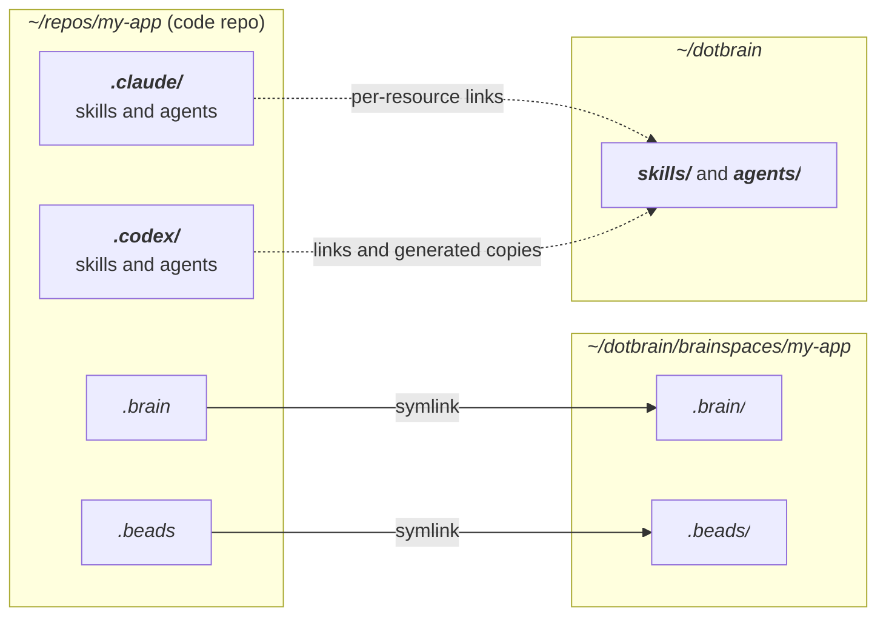
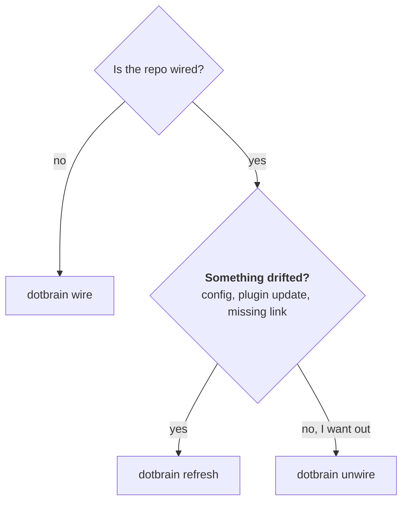

# 项目连接

连接（wiring）把代码仓库连到一个私有的 Brainspace。本页介绍会链接哪些东西、哪些保持私有，以及什么时候用
`wire`、`refresh` 或 `unwire`。第一次使用，请从[快速开始](getting-started.md)开始。

## 会链接哪些东西 {#what-gets-linked}



| 条目 | 类型 | 指向 |
| --- | --- | --- |
| `.brain` | 符号链接 | Brainspace 的 Brain |
| `.beads` | 符号链接 | Brainspace 的执行存储 |
| `.claude/`、`.codex/` | 真实目录 | 存放逐个被忽略的选定运行时资源 |

`.claude` 和 `.codex` 保持为真实目录，这样项目原本放在里面的东西（设置、命令）都不受影响。技能和 Claude
Agent 是符号链接。Codex Agent 是生成的真实 TOML 文件，带有 `# dotbrain-managed-agent: v1` 标记。
dotbrain 可以覆盖和清理带标记的副本；要自定义，请改私有主目录里的源文件。没有标记的文件和其他来源的
链接都会保留。每个分发的资源都单独被忽略。

Brainspace 放在 `~/dotbrain/brainspaces/<name>/` 下。旧的 `~/dotbrain/projects/<name>/` 布局仍然能识别；
新的 Brainspace 会建在 `brainspaces/` 下。

## 该用哪个命令 {#which-command-to-use}



## `wire`

创建 Brainspace，或者连接一个 checkout（包括链接出来的 Git worktree）。

::: code-group

```bash [在仓库里]
cd ~/repos/my-app
dotbrain wire
```

```bash [在任意目录]
dotbrain wire --repo ~/repos/my-app
```

```bash [只建 Brain]
dotbrain wire --no-repo --project research
```

:::

`wire` 会创建或修复：

- 私有的 Brainspace，从 Brain 模板初始化
- 仓库根目录的 `.brain` 和 `.beads` 链接，以及它们的忽略规则
- 项目的 `project.yaml`
- `agents:` 下列出的每个工作区里选定的技能和子 Agent
- Beads 任务跟踪，除非你传了 `--skip-beads`

第一次连接主 checkout 时，Brainspace 的名字默认是仓库的目录名；想换名字可以传 `--project`。
之后的维护沿用已有连接的身份。

## `refresh`

修复或重新同步一个已经连接的项目，而不是当成全新连接来处理。

```bash
dotbrain refresh                 # the current repo
dotbrain refresh --project my-app   # one project, from anywhere
dotbrain refresh --all           # every project
```

以下情况之后运行它：

- 修改了 `project.yaml`
- 更新了插件或 CLI，需要让 `DOTBRAIN.md` 等 dotbrain 维护的文件保持最新
- 发现缺了某个链接或工作区文件
- 想把最新的执行状态拉到某个 checkout 里

## `unwire` {#unwire}

断开选定的 checkout，保留它的 Brainspace 和共享的任务跟踪。

```bash
dotbrain unwire                          # current wired checkout
dotbrain unwire --repo ~/repos/my-app     # explicit checkout
dotbrain unwire --project my-app         # registered checkout
```

用户自己的工作区文件、主 checkout 的注册信息和其他 worktree 都会保留。只要还有其他已连接的 checkout 需要，
共享的 Git exclude 条目也会保留。要归档、恢复或删除 Brainspace 目录，请用你自己的文件系统操作；
断开连接不会做这些事。

`unwire` 从不碰远程的 Beads 数据库。对于用服务器的项目，删除那个数据库是单独的一步：
[`dotbrain beads drop-db`](beads-backend.md#cleaning-up)。

## Worktree {#worktrees}

worktree 和主 checkout 共用同一个 Brain 和执行存储。`dotbrain wire` 通过 Git 元数据找到主 checkout，
直接连到它已有的 Brainspace。如果主 checkout 的连接缺失或有冲突，命令会直接失败，而不会以 worktree 的名字
新建一个项目。

```bash
cd ~/repos/my-app-feature
dotbrain wire
dotbrain doctor
dotbrain refresh
dotbrain unwire
```

连接时会创建真实的本地运行时目录，保留项目自己的文件，不改动主 checkout 的注册信息和声明。它不会重新初始化
共享的 Brain，也不会同步任务跟踪；worktree 和主 checkout 共用这两者，由 `refresh` 维护。在已连接的
worktree 里运行不带参数的维护命令和资源链接命令，只影响这个 checkout；refresh 还会维护共享的 Brain 约定和
任务跟踪状态。按名字选择和 `--all` 用的是已注册的 checkout，不会扫描所有 worktree。

## 选择项目与结果输出 {#selection-and-reports}

项目命令默认作用于当前已连接的 checkout，包括它的子目录。在它之外，请用 `--project <name>`。按名字选择时，
`.repo.local` 优先于 `.repo`；对于不需要 checkout 的操作，只有 Brain 的项目也是有效的。用
`dotbrain projects list` 和 `dotbrain projects show` 查看项目身份和解析后的设置，不会探测远程。

`--all` 不能和 `--project`、`--repo` 一起用。适用的子命令都接受 `--home <path>` 和 `--json`。JSON 输出是
一个完整的结果，在部分成功的批量操作中也会保留每个项目的结果；退出码 0 表示成功，1 表示操作未完成，
2 表示选择或调用无效。运行时过滤只会选择已声明的运行时，从不启用未声明的工作区。

::: danger 不要手动创建链接
`.claude` 和 `.codex` 下的链接使用相对路径，是根据 checkout 的真实位置计算出来的。手数 `../` 层数写出来的
链接会悄无声息地失效。
:::

## 故障排查 {#troubleshooting}

```bash
dotbrain doctor     # read-only: what is missing or drifted
dotbrain refresh    # repair a wired project
dotbrain wire       # reconnect if the relationship changed
```

更多内容见[故障排查与常见问题](troubleshooting.md)。
