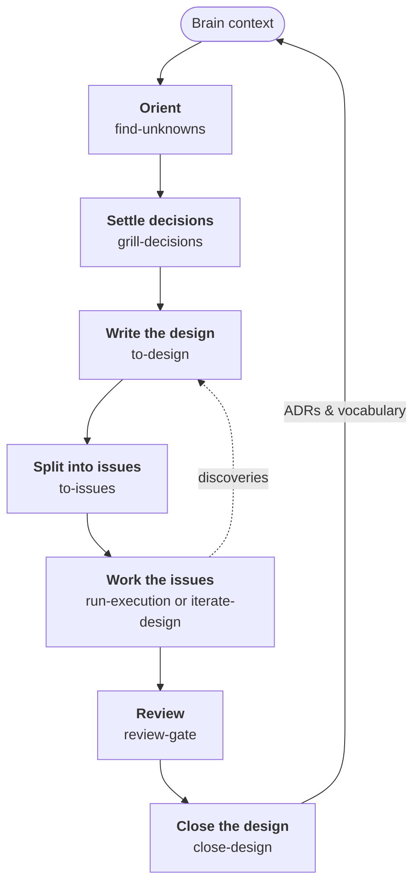
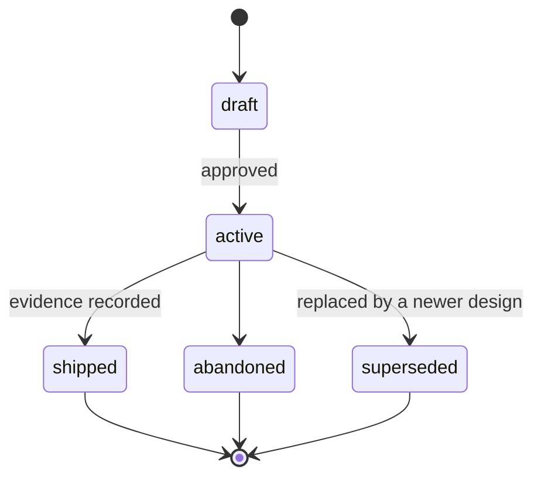

# 工作流程

Dotbrain 给 Agent 一个存放所学内容的地方。本页跟着一项工作，从最初的想法走到结束设计，并说明每一步
由哪个技能负责。

这些步骤都不是必须的。一行代码的修复，只需要会话开始时加载的 Brain 上下文就够了。当工作跨多个会话、
涉及不熟悉的代码，或者还有悬而未决的问题时，完整的闭环才划算。

## 闭环一览 {#the-loop-at-a-glance}



<ol class="flow-steps">
<li><a href="#_1-orient"><strong>摸清情况</strong><code>find-unknowns</code></a></li>
<li><a href="#_2-settle-decisions"><strong>敲定决策</strong><code>grill-decisions</code></a></li>
<li><a href="#_3-write-the-design"><strong>写设计</strong><code>to-design</code></a></li>
<li><a href="#_4-split-into-issues"><strong>拆成任务</strong><code>to-issues</code></a></li>
<li><a href="#_5-work-the-issues"><strong>处理任务</strong><code>manage-work-graph</code><code>run-execution</code><code>iterate-design</code></a></li>
<li><a href="#_6-review"><strong>审阅</strong><code>review-gate</code></a></li>
<li><a href="#_7-close-the-design"><strong>结束设计</strong><code>close-design</code></a></li>
</ol>


两个回路让闭环合上：工作中的新发现流回设计；结束设计时，其中的决策写回 Brain。

每一步都通过文件或任务记录交接，而不是靠聊天记录。新会话可以从任意一步接着做，因为它需要的状态都在
Brain 或 Beads 里。

## 1. 摸清情况 {#_1-orient}

动不熟悉的代码之前，先让 Agent 运行 `find-unknowns`。它会对照 Brain 阅读这块代码，报告那些会改变你做法的东西：
缺失的术语、代码并不支持的假设、没人写下来的约束。

```text
Run find-unknowns on the payment retry path before we change it.
```

## 2. 敲定决策 {#_2-settle-decisions}

`grill-decisions` 会对照项目已有的术语和决策，就一个计划逐个分支地追问你。每定下一件事，就当场记下来：

- 新的或更精确的术语写进 `CONTEXT.md`
- 难以撤回、有真实取舍的选择成为 `adr/` 里的一条 ADR

## 3. 写设计 {#_3-write-the-design}

`to-design` 把敲定的方案写成 `.brain/designs/` 里的一份设计文档，并在 Beads 里开一个跟踪用的 epic。
设计处于 active 状态时，它就是这项工作的权威依据：方案、成功标准、已知的未知项，以及实现过程中
发现的偏差。

设计会经过一组固定的状态：



只有 `draft` 和 `active` 状态的设计会变化。进入终态的设计是某个时间点的记录。

## 4. 拆成任务 {#_4-split-into-issues}

`to-issues` 把设计拆成 epic 下的一组垂直切片任务，每个任务都带验收标准和 `blocks` 依赖。
这样“接下来能做什么”就成了一次查询，而不用翻文档：

```bash
bd ready
```

## 5. 处理任务 {#_5-work-the-issues}

`manage-work-graph` 维护工作图：创建、关联和认领任务，在满足标准时关闭它们。`run-execution` 负责完成一个任务
或一批固定的任务：分派 worker，让每个改动都经过审阅，合并结果，运行检查，在达到重试上限或需要人来决定时停下。
如果实现过程中发现了设计没预料到的情况，这个发现会写回设计和相关任务，下一个会话就能看到。

每次运行都有两个相互独立的选择：谁来主导，以及同时有几个 Agent 在写代码。

任务分配、归属和内置 subagent 的协作方式，见[和 Agent 团队一起工作](agent-team.md)。

| | 顺序 | 并行 |
|---|---|---|
| **人在回路中**：每一步由你指挥 | 同一时间只有一个 Agent 在写，通常就是你自己的会话。 | 多个 worker 同时处理互不相关的任务，各自在自己的 worktree 里。 |
| **交接**：Agent 在你批准的约定范围内继续 | `iterate-design` 一次处理一个任务。 | `iterate-design` 并行处理互不相关的任务。 |

只有当几个任务同时就绪、改的是不同文件、并且不共用构建产物、数据库或端口时，Agent 才会并行处理它们。
如果由你指挥，它会在开始前告诉你打算怎么拆分，你可以调整。

无论哪种方式，工作都在一个专用分支上进行，通过你审阅的 PR 进入 `main`。Agent 在推送或开 PR 之前会先问你，
只有你明确要求时，才会直接把工作合进 `main`。

**也可以交给它自己跑。** 针对一个 active 的设计做无人值守运行时，`iterate-design` 会以 Agent 的循环模式运行，
配一个机械化的验证器和一个硬性的停止条件。你先批准一份约定：范围、分支、检查项、最多同时运行几个 worker，
以及 PR 怎么交付。然后：

- 第一次推送时，它会开一个 draft PR，之后每组改动完成审阅、组合检查和验收后再推送。
- 如果一个任务连续三次没通过检查，或者需要你来决定，只有这个任务和依赖它的任务会停下，互不相关的任务继续。
- 运行因阻塞而停下时，它会在 PR 上提到你，让你收到通知。
- 全部完成并审阅后，它会把 PR 标记为 ready，并请你审阅。合并始终由你来做。

## 6. 审阅 {#_6-review}

审阅发生在两个层面：

- **每个任务。** 代码、测试、构建或 CI 配置、Agent 指令的每一处改动，在任务关闭前都要经过一次独立审阅，
  审阅者是一个没参与编写的 reviewer Agent。一次审阅可以覆盖一组已暂时集成的相关改动。
  Reviewer 把完整发现交给 lead，lead 先记录，再把修复交回原 worker。审阅包括改动在未修改的调用方和交互中引起的回归。
  组合检查和必需审阅覆盖准确的集成版本后，才能关闭任务并释放依赖。
  审阅者批准或要求修改，由原来的 Agent 修复自己的工作；
  连续三次要求修改，任务就会停下等你决定。只改文字说明的改动不需要审阅。如果由你指挥，Agent 可能会问你
  某个小改动是否需要审阅，并给出它的建议。
- **整个分支。** 一个包含多个任务的分支在提交合并之前，由独立 reviewer 检查整个 diff：
  这些任务是否衔接得上，是否符合设计。最后一次集成审阅只有明确覆盖准确的最终版本和整个分支，才能兼作最终审阅；
  只批准最后一组改动不够，否则另做全分支审阅。后续变化影响覆盖时要更新证据。
  交接模式下还会做一轮简化审阅。它的建议不会阻塞 PR，由你和 PR 一起决定。

`review-gate` 以专注的模式（正确性、简化或就绪性）运行这些审阅，并把每次结果记录在任务跟踪里。
Agent 从不凭自己的判断关闭审阅：只有看到你合并了被审阅的 PR，它才会关闭对应的代码审阅记录，
其他审阅都等你来关。

## 7. 结束设计 {#_7-close-the-design}

`close-design` 把设计推进到终态。它记录成功标准已经达成的证据，把应该比这项工作活得更久的内容提升到
`adr/` 和 `CONTEXT.md`，然后关闭 epic。下一项工作开始时，这些决策已经在 Brain 里了。

::: tip 谁负责什么
Agent 可以自由写入 Brain，每次改动都是 dotbrain 主目录里的一次提交，可以审阅，也可以撤回。
成功标准是例外：Agent 可以提议修改，但只有你能批准。
:::

## 相关内容 {#related}

- [技能](skills.md)列出了所有技能及一句话说明。
- [架构](architecture.md)解释了为什么 Brain 和任务跟踪要分开。
