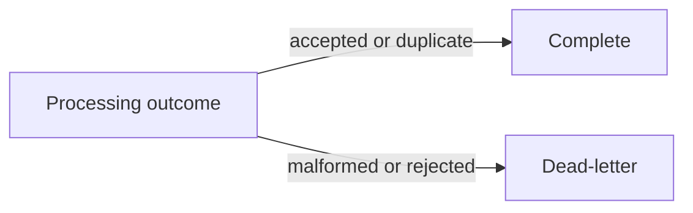
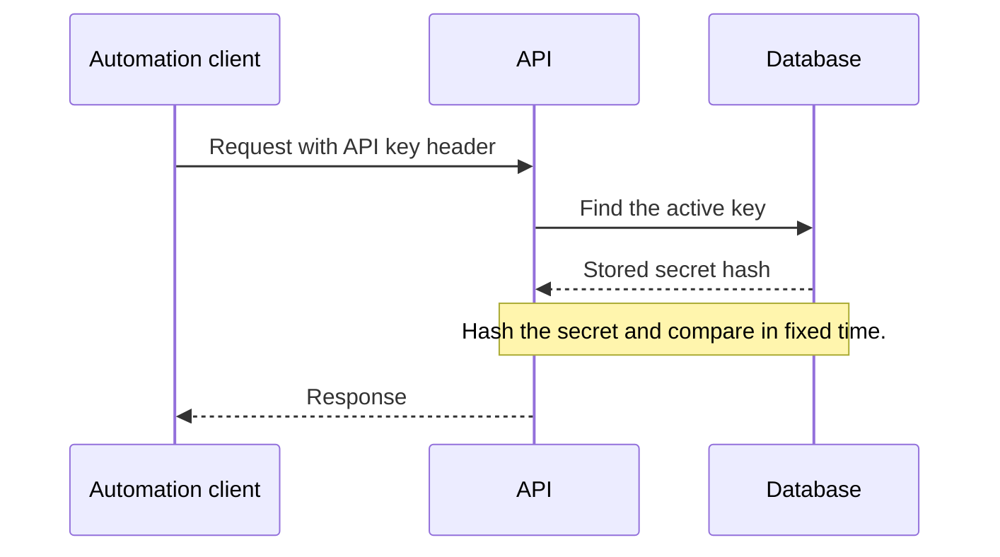
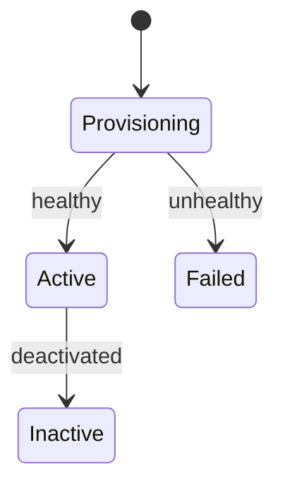

# Mermaid diagrams in lessons

Read this before drawing a diagram in a lesson or reference. Diagrams are fenced `mermaid` blocks;
the official [syntax reference](https://mermaid.js.org/intro/syntax-reference.html) holds the full
grammar for each type.

## What the site already does

The theme's `Mermaid` component draws each block in the browser and handles presentation, so a
diagram contains structure only:

- The `neo` look, the site font, and the site's colours in both themes. Leave out `%%{init}%%`,
  `classDef`, `style`, and `linkStyle`: they fight the site theme and break dark mode.
- Flowcharts and state diagrams keep their natural size, shrink to fit down to 85%, and scroll
  sideways beyond that. Sequence diagrams stretch to fill the content column.
- A diagram that fails to parse shows a red error box with Mermaid's message and the source.
  The build still passes, so open the page to check every diagram you write.

## Every diagram

- Start with `accTitle: <what the diagram shows>`. It is the diagram's accessible name.
- Use short ids and put the words in a quoted label: `api["Orders.Api"]`. Quote any
  label with spaces or punctuation.
- Diagram text is not in the site search. Name the key steps in the surrounding prose too.
- A trace whose steps are whole sentences reads better as a numbered list or a `text` block.

## Pick the type

| The reader needs to see | Type |
|---|---|
| A branch, a fan-in, shared steps, or what travels along an arrow | `flowchart` |
| A request passing between participants: browser, API, identity provider | `sequenceDiagram` |
| A lifecycle: a revision, a delivery, a message's settlement | `stateDiagram-v2` |

## Flowcharts

Mermaid keeps the direction you write, so choose it for the page. The content column is about
600px on a laptop and wider on larger screens: use `LR` for fans and chains of up to five short
steps, and `TB` for longer chains, long labels, or graphs. Write a branch or a merge as another
line that reuses an id. Label an arrow with `-->|label|`.

## Sequence diagrams

- Keep participant names to a word or two. Participant boxes narrow to fit the column, and a long
  single word breaks mid-word: put detail such as `MessageQueueProcessor` in a message instead.
- Up to five participants fit a laptop column; more scroll.
- Keep messages short and let them wrap on their own; leave out ` `.
- A note over one participant is narrow. Span two for longer text: `Note over Api,Db: ...`.
- Put exact wire formats, such as headers and query strings, in an `http` block above the diagram
  rather than in a message.
- Use `->>` for a request and `-->>` for a response.

## State diagrams

`[*]` marks the start; `State --> Other: event` labels a transition.

## Pitfalls

| Avoid | Use instead | Why |
|---|---|---|
| `end` as a flowchart id | `finish["End"]` | `end` is a keyword; the diagram fails to parse |
| `a[Worker (Processor)]` | `a["Worker (Processor)"]` | Parentheses, brackets, and braces end an unquoted label |
| Styling directives | Structure only | The site theme owns colours and fonts |
| Trusting a passing build | Opening the page | Parse errors appear only in the browser |
