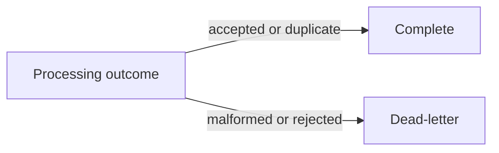
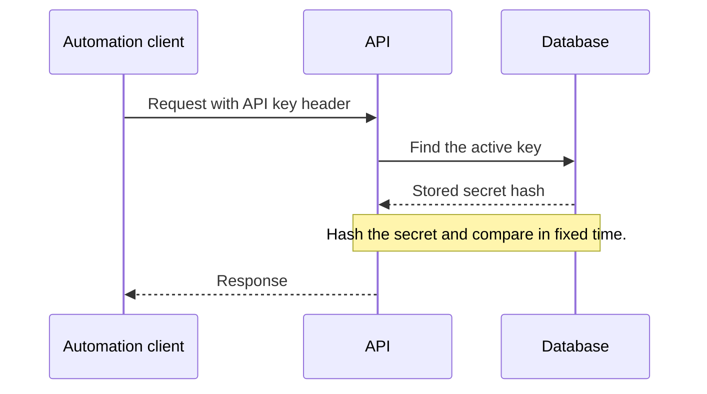
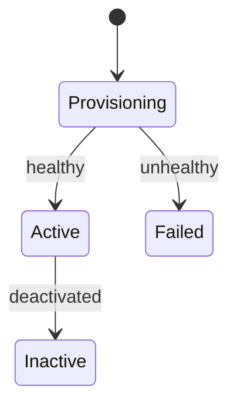

# Mermaid diagrams

Read this before drawing a diagram on a Brain site page, or in any project doc rendered with
Mermaid. Diagrams are fenced `mermaid` blocks;
the official [syntax reference](https://mermaid.js.org/intro/syntax-reference.html) holds the full
grammar for each type.

## What the site already does

The theme's `Mermaid` component draws each block in the browser and handles presentation, so a
diagram contains structure only:

- The `neo` look, the site font, and the site's colours in both themes. Leave out `%%{init}%%`,
  `classDef`, `style`, and `linkStyle`: they fight the site theme and break dark mode.
- Flowcharts and state diagrams keep their natural size, shrink to fit down to 85%, and scroll
  sideways beyond that. Sequence diagrams stretch to fill the content column.
- A diagram that fails to parse shows a red error box with Mermaid's message and the source.
  The build still passes, so open the page to check every diagram you write.

## Every diagram

- Start with `accTitle: <what the diagram shows>`. It is the diagram's accessible name.
- Use short ids and put the words in a quoted label: `api["Orders.Api"]`. Quote any
  label with spaces or punctuation.
- Diagram text is not in the site search. Name the key steps in the surrounding prose too.
- A trace whose steps are whole sentences reads better as a numbered list or a `text` block.

## Labels

One label style across every diagram, so readers learn it once:

- **Two lines: a bold name, then what it holds or does.** Write it as a markdown string, a quoted
  label wrapped in backticks:

  ```text
  plugin["`**Plugin**
    skills, convention, hook`"]
  ```

- **One line stays plain.** Bold only the first line of a two-line label; when everything is bold,
  nothing stands out.
- **Paths and file names are italic:** `*.brain/*`, `*~/dotbrain*`, `*AGENTS.md*`; on a bold line,
  `***.brain/***`. Backticks cannot appear inside a markdown string, so a path cannot be code.
  Sequence diagrams do not format text; paths stay plain there.
- **Arrow labels are plain verb phrases:** `reads and writes`, `wires`, `records decisions`.
- **Join phrases with words, commas, or a line break**, never a separator such as `·` or `|`.
- **An action is an arrow, not a note.** In a sequence diagram, the agent reading a file is a
  message to that file's participant; keep notes for commentary.

## Pick the type

| The reader needs to see | Type |
|---|---|
| A branch, a fan-in, shared steps, or what travels along an arrow | `flowchart` |
| A request passing between participants: browser, API, identity provider | `sequenceDiagram` |
| A lifecycle: a revision, a delivery, a message's settlement | `stateDiagram-v2` |
| A folder layout: what lives where | `treeView-beta` |

## Flowcharts



Mermaid keeps the direction you write, so choose it for the page. The content column is about
600px on a laptop and wider on larger screens: use `LR` for fans and chains of up to five short
steps, and `TB` for longer chains, long labels, or graphs. A diagram that is too wide as `LR` usually
fits as `TB` with `direction LR` inside each subgraph, one row per group.

Arrows are drawn as straight runs with rounded corners. Mermaid ignores curve settings for them, so
leave those out. Write a branch or a merge as another
line that reuses an id. Label an arrow with `-->|label|`.

## Sequence diagrams



- Keep participant names to a word or two. Participant boxes narrow to fit the column, and a long
  single word breaks mid-word: put detail such as `MessageQueueProcessor` in a message instead.
- Up to five participants fit a laptop column; more scroll.
- Keep messages short and let them wrap on their own; leave out `<br/>`.
- A note over one participant is narrow. Span two for longer text: `Note over Api,Db: ...`.
- Put exact wire formats, such as headers and query strings, in an `http` block above the diagram
  rather than in a message.
- Use `->>` for a request and `-->>` for a response.

## State diagrams



`[*]` marks the start; `State --> Other: event` labels a transition.

## Tree views


- Use a tree view for any folder layout, never a hand-drawn `├──` block.
- Indentation is the hierarchy. End a folder with `/`; it is drawn bold with a folder icon.
- `## text` after a name is its description. Keep descriptions short; they line up in one column
  after the longest name, so one long name pushes them all right.
- Keep roots short (`repos/my-app/`), and give the full location in the prose.
- A symlink is a plain entry whose description names its target: `.brain ## link to .brain/`.
- The site supplies icons and colours, and hides Mermaid's implicit `/` root. The label rules above
  do not apply: every entry is a path, so none is italic.

## Pitfalls

| Avoid | Use instead | Why |
|---|---|---|
| `end` as a flowchart id | `finish["End"]` | `end` is a keyword; the diagram fails to parse |
| `a[Worker (Processor)]` | `a["Worker (Processor)"]` | Parentheses, brackets, and braces end an unquoted label |
| Styling directives | Structure only | The site theme owns colours and fonts |
| Trusting a passing build | Opening the page | Parse errors appear only in the browser |
| `` `code` `` inside a markdown-string label | `*italic*` | Backticks end the markdown string; the diagram fails to parse |
| A step list with no branches as a diagram | A numbered list | A straight chain of boxes adds height, not meaning |
